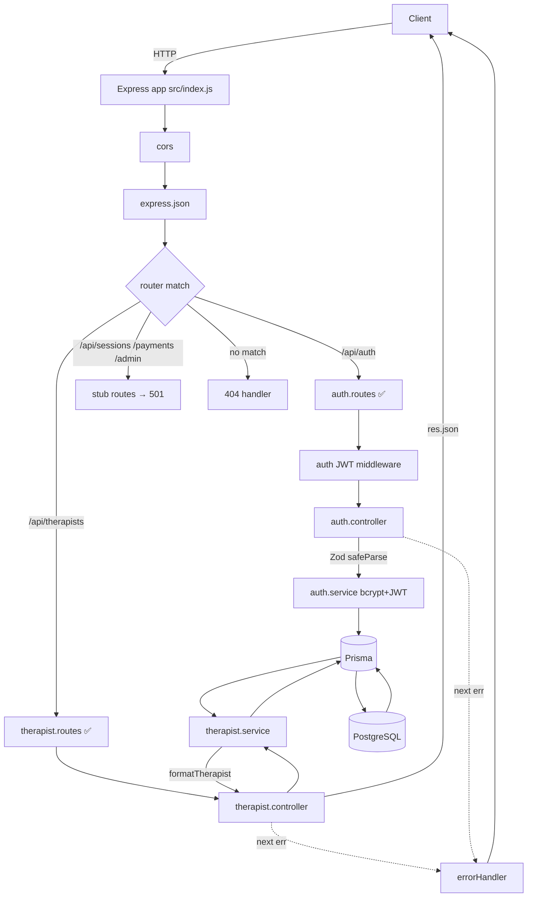
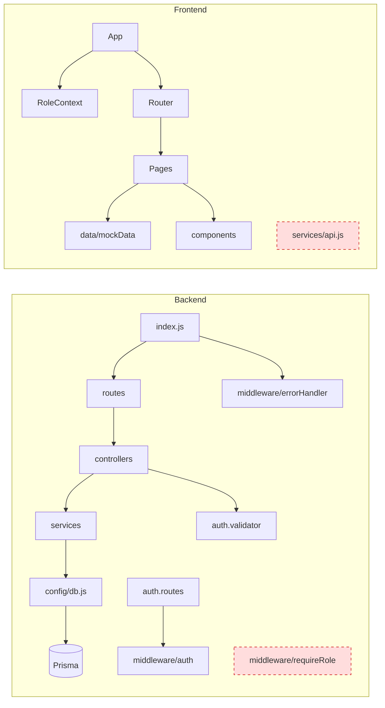
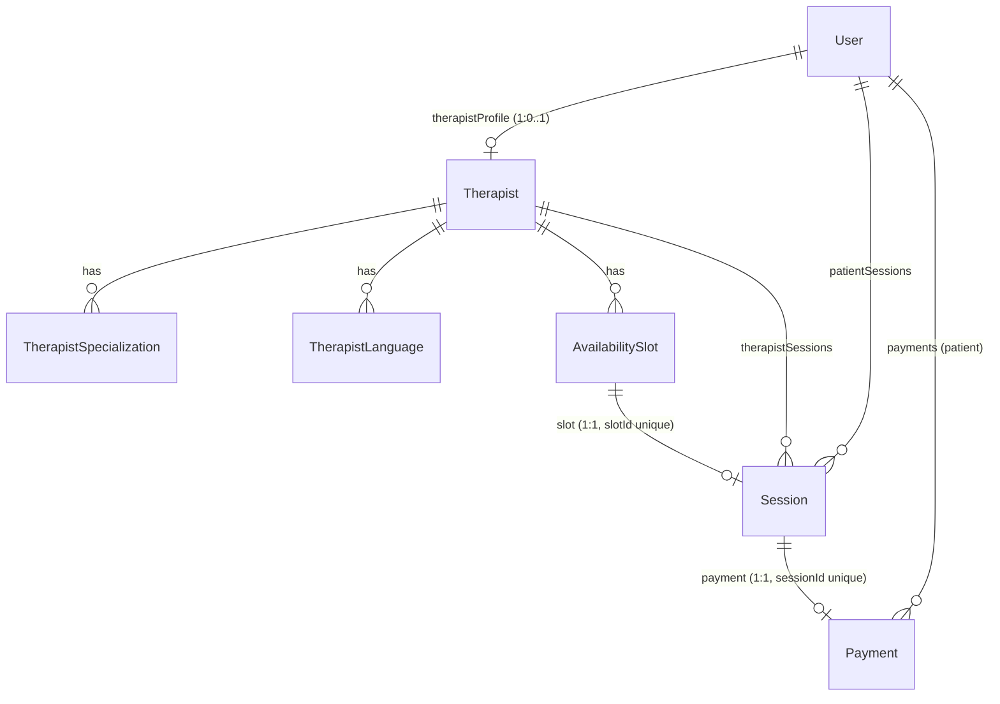

# Project Memory — MindBridge (repo folder: `Sukoon`)

> Read-only reconnaissance produced 2026-06-21. This file is a mental model of the
> codebase as it exists on the `master` branch working tree. No source code was
> changed to produce it. Where the working tree differs from `HEAD`, that is noted.

---

## 1. Overview

**MindBridge** is an online therapy / mental-health platform aimed at a Pakistani
audience (PKR pricing, EasyPaisa payment flow, Urdu copy, English/Urdu/Punjabi/Sindhi
languages). It lets **patients** browse and book qualified **therapists** for two
"tracks" — *mental-health* and *career* counseling — pay by uploading a manual
EasyPaisa transfer screenshot, and manage sessions from a dashboard; **therapists**
manage their schedule/patients; and **admins** verify payments and oversee the
platform.

The repo is a **two-part monorepo** built in numbered "phases" (it reads like a
teaching/portfolio project):
- `Backend/` — a real Express + Prisma + PostgreSQL REST API. **Auth and the public
  therapist API are built and working; session booking, payments, and admin are
  unimplemented stubs.**
- `Frontend/` — a polished React + Vite + Tailwind SPA that is a **standalone UI
  prototype running entirely on hardcoded mock data**. It does **not** talk to the
  backend at all (see §11).

> ⚠️ Naming: the root folder is `Sukoon` but every artifact in the code calls the
> product **MindBridge**. Treat "MindBridge" as the product name.

---

## 2. Tech Stack

| Concern | Backend | Frontend |
|---|---|---|
| Language/Runtime | Node.js, ESM (`"type":"module"`) | Node.js, ESM |
| Framework | Express 4 | React 18 + React Router 6 |
| Build/Dev | nodemon (`npm run dev`) | Vite 8 (`npm run dev`) |
| DB | PostgreSQL | — (mock data) |
| ORM | Prisma 5 | — |
| Validation | Zod 4 (**auth only**) | none (uncontrolled/`required` attrs) |
| Auth | `jsonwebtoken` 9 (JWT, 7d), `bcryptjs` 3 | **simulated** via React context |
| Styling | — | Tailwind 3 + PostCSS + custom `@layer` classes |
| Other | `cors` (wide open), `dotenv` | ESLint 9 configured |
| Tests | none in repo (docs cite manual curl tests) | none |

Default ports: API `5000` (`PORT` env), Vite dev `5173`.

---

## 3. Directory Map

```
Sukoon/
├── Backend/                         # Express + Prisma REST API
│   ├── .env.example                 # DATABASE_URL, PORT, JWT_SECRET, NODE_ENV
│   ├── nodemon.json                 # watch src, exec node src/index.js
│   ├── package.json                 # scripts: dev / start / seed
│   ├── repomix-output.xml           # ⚠ committed generated repo snapshot (artifact)
│   ├── prisma/
│   │   ├── schema.prisma            # 7 models + 4 enums (full domain model)
│   │   ├── seed.js                  # seeds 4 THERAPIST users (npm run seed) [untracked]
│   │   └── migrations/
│   │       └── 20260504184846_init/migration.sql   # the ONLY migration
│   └── src/
│       ├── index.js                 # ENTRY: app, CORS, json, routes, 404, errorHandler
│       ├── config/db.js             # singleton PrismaClient
│       ├── routes/                  # auth ✅ | therapists ✅ | sessions/payments/admin = 501 stubs
│       ├── controllers/             # auth ✅ | therapist ✅ | session/payment/admin = 501
│       ├── services/                # auth ✅ | therapist ✅ | session/payment = THROW (stub)
│       ├── middleware/              # auth.js (JWT) ✅ | requireRole.js (UNUSED) | errorHandler.js ✅
│       └── validators/              # auth.validator.js (Zod) — ONLY auth [untracked]
│
├── Frontend/                        # React SPA (mock-data prototype)
│   ├── index.html  vite.config.js  tailwind.config.js  postcss.config.js
│   ├── repomix-output.xml           # ⚠ committed generated artifact
│   └── src/
│       ├── main.jsx  App.jsx        # router + RoleProvider + global Navbar
│       ├── index.css                # Tailwind layers + component classes (btn-*, card, etc.)
│       ├── context/RoleContext.jsx  # fake auth: role + hardcoded currentUser
│       ├── config/sidebarConfig.jsx # ADMIN_NAV / THERAPIST_NAV / PATIENT_NAV
│       ├── services/api.js          # ⚠ MOCKED + entirely UNUSED (pages bypass it)
│       ├── data/mockData.js         # all UI data lives here
│       ├── components/              # Navbar, Footer, TherapistCard, SidebarLink, ProtectedRoute
│       └── pages/                   # 11 pages (marketing + auth + booking + 3 dashboards)
│
├── src/                             # ⚠ STALE DUPLICATE of Frontend/src (untracked, orphaned — see §11)
├── PHASE3_*.md / README_PHASE3.txt  # 6 docs, all about "Phase 3: Therapist Public API"
└── .claude/settings.local.json      # local tool permissions
```

Note on git state: root `README.md` and root `.gitignore` are **deleted** in the
working tree; `Backend/src/*`, `prisma/*`, and many `Frontend/src/*` files are
**modified but uncommitted**; `validators/`, `seed.js`, the `PHASE3_*` docs, and the
orphan `src/` are **untracked**. There is substantial uncommitted work in flight.

---

## 4. Architecture

### Pattern
- **Backend:** classic **layered MVC** — `Route → Controller → Service → Prisma (ORM) → PostgreSQL`,
  with cross-cutting middleware (CORS, JSON parsing, JWT auth, error handling) and a
  Zod validation step inside controllers. Clean, conventional separation of concerns.
- **Frontend:** **client-side SPA** — React Router routes render page components that
  pull from a global `RoleContext` (simulated auth) and a static `mockData` module.
  `ProtectedRoute` gates dashboard/booking routes by role.

### Layer responsibilities (backend)
| Layer | Responsibility | Throws/returns |
|---|---|---|
| Routes | map URL+verb → controller, attach middleware | — |
| Controllers | parse `req`, Zod-validate, call service, shape JSON, `next(err)` | 201/200/400 |
| Services | business logic, Prisma queries, data transform, throw `Error` w/ `.status` | domain errors |
| `config/db.js` | one shared `PrismaClient` (connection pool) | — |
| Middleware | `auth` (verify JWT → `req.user`), `requireRole` (RBAC, **unused**), `errorHandler` (final) | 401/403/500 |

### Request lifecycle (the working therapist endpoint)


### Module dependencies

`requireRole` and `services/api.js` are dotted/dead — present but referenced by nothing.

There are **no circular dependencies**. The two halves of the monorepo are fully
decoupled — in fact, completely disconnected (no shared types, no HTTP calls).

---

## 5. Key Files & Their Roles

### Backend
| File | Responsibility | Key exports | Depends on | Depended on by |
|---|---|---|---|---|
| `src/index.js` | App bootstrap, middleware, route mounting, 404, error handler, `listen` | `app` (default) | all routes, errorHandler, cors, dotenv | — (entry) |
| `src/config/db.js` | Singleton `PrismaClient` | `prisma` (default) | `@prisma/client` | all services |
| `prisma/schema.prisma` | Domain data model (7 models, 4 enums) | — | — | Prisma client/migrations |
| `prisma/seed.js` | Seed 4 therapist users+profiles (`npm run seed`) | — | PrismaClient, bcrypt | manual |
| `src/middleware/auth.js` | Verify `Bearer` JWT → `req.user={id,email,role}`, else 401 | `auth` (default) | jsonwebtoken | `auth.routes` only |
| `src/middleware/requireRole.js` | RBAC factory `requireRole(...roles)` → 401/403 | default | — | **nothing (dead code)** |
| `src/middleware/errorHandler.js` | Final error middleware → `{error[,stack]}` | default | — | `index.js` |
| `src/validators/auth.validator.js` | Zod `registerSchema`/`loginSchema`/`updateProfileSchema` | named | zod | `auth.controller` |
| `src/services/auth.service.js` | register/login/getMe/update; bcrypt, JWT sign, `sanitizeUser` | named (4) | db, bcrypt, jwt | `auth.controller` |
| `src/services/therapist.service.js` | list+filter, byId, slots, `formatTherapist` (Decimal→num, flatten) | named (3) | db | `therapist.controller` |
| `src/services/session.service.js` | **STUB** — every fn `throw 'not yet implemented'` | named (4) | db | `session.controller` (also stub) |
| `src/services/payment.service.js` | **STUB** — every fn `throw 'not yet implemented'` | named (4) | db | `payment.controller` (also stub) |
| `src/controllers/auth.controller.js` | register/login/logout/getMe/updateMe; Zod safeParse → 400 | named (5) | auth.service, validators | `auth.routes` |
| `src/controllers/therapist.controller.js` | 3 thin HTTP handlers, try/catch→next | named (3) | therapist.service | `therapist.routes` |
| `src/controllers/{session,payment,admin}.controller.js` | **all methods return HTTP 501** | named | — | not wired to routes |
| `src/routes/auth.routes.js` | `POST /register /login`, `POST /logout`(auth), `GET/PATCH /me`(auth) | router | auth.controller, auth mw | `index.js` |
| `src/routes/therapist.routes.js` | `GET /`, `GET /:id`, `GET /:id/slots` (public) | router | therapist.controller | `index.js` |
| `src/routes/{session,payment,admin}.routes.js` | single `GET /` → **501** only | router | — | `index.js` |

### Frontend
| File | Responsibility | Notes |
|---|---|---|
| `src/main.jsx` / `src/App.jsx` | Mount; `BrowserRouter` + `RoleProvider` + global `Navbar` + `Routes` | route table in §6 |
| `src/context/RoleContext.jsx` | `useRole()` → `{role,setRole,currentUser,setCurrentUser}`; default role `'guest'`, hardcoded user "Sarah Rahman" | **the entire "auth" system** |
| `src/components/ProtectedRoute.jsx` | If `role ∈ allowedRoles` render children else `<Navigate to="/login">` | client-side only, trivially bypassable |
| `src/components/Navbar.jsx` | Top nav + **"Demo" role-switcher dropdown** (guest/patient/therapist/admin) | hidden on `/dashboard/*` |
| `src/config/sidebarConfig.jsx` | `ADMIN_NAV`/`THERAPIST_NAV`/`PATIENT_NAV`, `getNavByRole`, `shouldShowBookSessionButton` | used by therapist & admin dashboards |
| `src/data/mockData.js` | `therapists`, `patientSessions`, `pastSessions`, `therapistSchedule`, `adminPayments`, `adminTherapists` | **all real UI data** |
| `src/services/api.js` | Mock API returning `Promise.resolve(mock)`; reads unused `VITE_API_URL` | **dead code — no page imports it** |
| `src/components/TherapistCard.jsx` | Therapist grid card → links `/therapist/:id`, `/book/:id` | uses `fee`,`reviews` (mock shape) |
| `src/pages/*` | 11 pages (see §6 & §10) | dashboards are large (508/485/670 lines) |

---

## 6. Code Flow

### Flow A — Backend register (REAL, fully implemented)
1. `POST /api/auth/register` → `index.js` CORS+json → mounted `auth.routes`.
2. `auth.routes` → `authController.register`.
3. Controller runs `registerSchema.safeParse(req.body)`. On failure → `400 {error:'Validation failed', details:[{field,message}]}`.
4. On success → `authService.registerUser({name,email,password,role})`:
   - `prisma.user.findUnique({email})`; if exists → `throw Error` w/ `.status=409`.
   - `bcrypt.hash(password,10)`, derive initials, `prisma.user.create`.
   - `signToken({id,email,role})` (HS256, `JWT_SECRET`, 7d).
   - returns `{user: sanitizeUser(user), token}` (password stripped).
5. Controller → `201 {message,user,token}`. Any thrown error → `next(err)` → `errorHandler` → `{error}` (+`stack` in dev).
   - **Login** mirrors this; `loginUser` returns generic `401 "Invalid email or password."` for both unknown-email and bad-password (no user enumeration). `getMe`/`updateMe` require the `auth` middleware.

### Flow B — Backend therapist listing (REAL)
1. `GET /api/therapists?track=CAREER&maxFee=3000` → `therapist.routes` → `controller.getTherapists`.
2. `therapistService.getTherapists(req.query)` builds a Prisma `where` dynamically:
   `isActive:true` + optional `track` (`.toUpperCase()`), `specializations.some.name contains (insensitive)`, `languages.some`, `feePkr gte/lte`.
3. `prisma.therapist.findMany({where, include:{user,specializations,languages}, orderBy:{rating:'desc'}})`.
4. `formatTherapist` flattens nested user fields and casts `Decimal rating → Number`, maps spec/lang arrays → strings.
5. `200 {therapists:[...]}`. `getTherapistById` throws `.status=404 "Therapist not found."` when missing.
   - ⚠ Filter query params are **not validated** — e.g. `?maxFee=abc` → `Number('abc')=NaN` flows into the query (docs flag this; should be 400, currently risks 500).

### Flow C — Frontend booking → payment (MOCK, no network)
1. `Therapists`/`Home` render `TherapistCard` from `mockData.therapists` → link `/book/:id`.
2. `/book/:id` is wrapped in `ProtectedRoute allowedRoles={['patient']}`. `BookSession` finds the therapist in `mockData`, shows a hand-rolled calendar (pinned "today" = `2026-04-12`), enforces 9am–6pm slots, then `navigate('/payment/:id?date&slot&therapist&fee')`.
3. `/payment/:id` (also patient-gated): `Payment` reads query params, shows manual **EasyPaisa** instructions (send to `0301-1234567`), takes a txn id + screenshot upload, and on submit just sets local `submitted=true` (**nothing is sent anywhere**) → CTA to `/dashboard/patient`.
4. No `api.js`, no `fetch`, no backend involvement at any step.

### Flow D — Stub endpoints (important nuance)
- `GET /api/sessions|payments|admin` → matches the single stubbed `GET /` → `501 {message:'... not yet implemented'}`.
- `POST /api/sessions` (and other verbs) → **no matching route** (stubs only define `GET /`) → falls through to the app-level **404** `{error:'Route POST /api/sessions not found'}`. The 501 methods sitting in those controllers are **not wired** to any route yet.

---

## 7. Data Model

Prisma/PostgreSQL (table names are snake_case via `@@map`). All PKs are `uuid`.



- **User** `{id,name,email(unique),passwordHash,role(Role=PATIENT),initials,avatarUrl?,phone?,language="English",isVerified=false,createdAt}`
- **Therapist** `{id,userId(unique→User),title,credentials,about,methodology,feePkr,rating(Decimal=0),reviewCount,sessionsCount,color,track(Track=MENTAL_HEALTH),isActive=true}`
- **TherapistSpecialization** / **TherapistLanguage** — simple 1-to-many child rows (`name` / `language`).
- **AvailabilitySlot** `{id,therapistId,slotDatetime,isBooked=false}` — one optional `Session`.
- **Session** `{id,patientId,therapistId,slotId(unique),status(SessionStatus=PENDING_PAYMENT),sessionNumber,sessionType,zoomLink?,notes?,moodPost?,durationMins=60,createdAt}`
- **Payment** `{id,sessionId(unique),patientId,amountPkr,serviceFee=250,totalPkr,txnId,screenshotUrl,status(PaymentStatus=PENDING),reviewedBy?,createdAt,approvedAt?}`
- **Enums:** `Role(PATIENT|THERAPIST|ADMIN)`, `Track(MENTAL_HEALTH|CAREER)`, `SessionStatus(PENDING_PAYMENT|CONFIRMED|IN_PROGRESS|COMPLETED|CANCELLED)`, `PaymentStatus(PENDING|APPROVED|REJECTED)`.
- All FKs are `ON DELETE RESTRICT ON UPDATE CASCADE`. The schema is **fully provisioned for the unbuilt booking/payment features** — only the read paths use it today.

> The frontend `mockData` uses an **entirely different, incompatible shape**: integer
> `id`, `fee`/`feeDisplay`/`reviews`/`image`, `track:"mental-health"|"career"` (lowercase),
> and different therapist names. Roles in the frontend are lowercase (`'patient'`) vs
> backend uppercase enums (`'PATIENT'`). Any future integration must reconcile these.

---

## 8. External Integrations

- **PostgreSQL** via Prisma (`DATABASE_URL`) — the only live external dependency.
- **EasyPaisa** — *not* an API integration. It is a **manual** flow: the UI shows a phone
  number, the user pays out-of-band and uploads a screenshot + txn id. (`Payment` model
  stores `screenshotUrl`/`txnId`; admin would approve manually — both unbuilt.)
- **Zoom** — only a `zoomLink` string field on `Session`; no Zoom API. Therapist dashboard
  lets a therapist paste a link (stored in local React state only).
- **Google Fonts (Inter)** — `@import` in `index.css`.
- Frontend "Continue with Google / LinkedIn" buttons are **decorative** (no OAuth).
- No queues, caches, email/SMS, file storage, or payment gateways are wired.

---

## 9. Conventions

**Backend**
- ESM throughout; relative imports include the `.js` extension.
- **Error handling:** services `throw new Error(msg)` with a numeric `.status`; controllers
  wrap in `try/catch` and `next(err)`; a single `errorHandler` formats `{error}` (adds
  `stack` only when `NODE_ENV==='development'`).
- **Validation:** controllers call `schema.safeParse(req.body)` and return
  `400 {error:'Validation failed', details:[...]}` — currently auth-only.
- **Security hygiene:** `sanitizeUser` strips `passwordHash`; JWT payload is `{id,email,role}`;
  login error messages are intentionally generic.
- **Response envelopes:** `{user,token}`, `{therapists}`, `{therapist}`, `{slots}`, `{error[,details]}`.
- **Two coexisting code styles** (likely different phases/authors):
  `auth.*` uses `export const fn = async () =>`, single quotes, **no semicolons**;
  `therapist.*` uses `export async function`, **semicolons**. No linter/formatter enforced on backend.

**Frontend**
- Function components + hooks; Tailwind utility classes plus shared component classes
  defined in `index.css` `@layer components` (`btn-primary`, `card`, `input-field`, `slot-btn*`, etc.).
- Custom Tailwind theme tokens: `brand`, `primary.*`, `bg`, `surface`, `success/danger/warning/muted`.
- Roles are lowercase strings in context. "Auth" = set `role` in `RoleContext`.
- Pages import mock data **directly**; `services/api.js` is the intended-but-unused seam.
- No tests anywhere; the PHASE3 docs' "8/8 passing" refers to manual curl checks, not a suite.

---

## 10. Current Phase Status

The 6 root docs describe a phased build. Reconciled against the actual code:

| Phase | Scope (per docs) | Reality in code |
|---|---|---|
| Phase 1 | Project setup, Prisma schema, DB, migration | ✅ Present (full schema, 1 init migration, db singleton). |
| Phase 2 | **Authentication** | ✅ **Complete & working** — register/login/logout/getMe/updateMe, JWT, bcrypt, Zod auth validators, `auth` middleware. (Docs slightly *understate* this, calling protection "Phase 4".) |
| Phase 3 | **Therapist Public API** (3 GET endpoints + filters + seed of 4 therapists) | ✅ **Complete & working** — matches docs closely. Docs label this *"← WE ARE HERE."* **This is where the backend currently sits.** |
| Phase 4 | **Booking System** — protected session booking, payments, admin payment review | ❌ **Not started.** Services throw, controllers return 501, routes are bare stubs. Schema/enums already exist for it. |
| Phase 5+ | Notifications/messaging, reviews, analytics | ❌ Not started (roadmap only). |

**Frontend status:** a near-complete **UI prototype** (marketing site, auth screens,
booking+payment flow, and three role dashboards) that is **finished-looking but mock-only**
and **disconnected from the backend**. It does not map cleanly onto the backend phase
numbering — treat it as a parallel track.

**Doc vs code drift (minor):** (1) docs list `requireRole.js` in the architecture without
noting it is unused; (2) docs say auth protection / validation are "Phase 4 / not yet added"
when auth + Zod auth validation already exist; (3) `/:id/slots` returns `[]` because no
`AvailabilitySlot` rows are seeded (endpoint itself works). Crucially, **no doc falsely
claims sessions/payments/admin are built** — docs and stub-reality agree on the big items.

---

## 11. Observed Risks & Tech Debt

*(Observations only — no fixes applied, per the recon brief.)*

1. **Frontend ↔ Backend are completely disconnected.** No page makes any HTTP call;
   `services/api.js` is mocked **and** unused (pages import `mockData` directly). The real
   auth/therapist APIs are never exercised by the UI. This is the single biggest gap.
2. **Orphan duplicate `src/` at repo root** mirrors `Frontend/src/` and differs only by
   trailing whitespace in one file (`Register.jsx`). It is untracked, has no build tooling,
   and is not what Vite serves (Vite uses `Frontend/`). Pure confusion risk.
3. **Data-shape & enum-casing mismatch** between frontend mock and backend schema
   (int vs uuid ids; `fee` vs `feePkr`; `reviews` vs `reviewCount`; lowercase
   `'mental-health'`/`'patient'` vs `MENTAL_HEALTH`/`PATIENT`). Integration will require a mapping layer.
4. **No RBAC is actually enforced.** `requireRole` is implemented but **never imported**
   by any route. Therapist endpoints are public by design; the protected endpoints don't exist yet.
5. **Frontend "auth" is cosmetic.** `ProtectedRoute` checks a client-side context value
   toggled by a visible "Demo" role-switcher and by an email-keyword check in `Login`
   (`admin@`/`therapist@`). No tokens, no server check — trivially bypassable.
6. **No input validation outside auth.** Therapist filter params are coerced unguarded
   (`?maxFee=abc` → `NaN`); session/payment/admin have no validators.
7. **Stale/misleading comments:** `middleware/auth.js` claims it's a "stub… jwt installed
   in Phase 2" though it is fully implemented and in use.
8. **Committed generated artifacts:** `Backend/repomix-output.xml` and `Frontend/repomix-output.xml`
   are tracked tool output (and `Frontend/repomix-output.xml` shows as modified). Migration
   SQL is oddly indented (cosmetic).
9. **Config/secrets:** `cors()` is wide open (no origin allow-list); `.env.example` ships a
   placeholder `JWT_SECRET`; JWT is 7d with no refresh/rotation; logout is client-side only
   (no token revocation/blacklist).
10. **Seed gaps:** `seed.js` creates only 4 THERAPIST users — **no AvailabilitySlots** (so
    `/:id/slots` is always empty) and **no PATIENT/ADMIN** users for end-to-end testing.
11. **Branding & cosmetic drift:** folder `Sukoon` vs product "MindBridge"; footer years
    `© 2024` vs `© 2026`; `TherapistDashboard` hardcodes "Dr. Arsalan Khan" and ignores
    `currentUser`; dashboards have large duplicated blocks and many non-functional buttons
    (Filter, Download CSV, Reschedule, View Screenshot, etc.).
12. **Git working tree is messy / WIP:** root `README.md` and `.gitignore` deleted; auth +
    validators + seed are uncommitted; the orphan `src/` and large `PHASE3_*` docs are
    untracked. Easy to lose or mis-commit work in this state.
13. **No automated tests or CI** anywhere; no Dockerfile/compose/infra config.

---

## 12. Open Questions for the User

1. **Orphan root `src/`** — is it intentional (some deploy/copy step) or leftover cruft
   that should be deleted? It's an untracked near-identical copy of `Frontend/src/`.
2. **Frontend↔Backend integration** — is Phase 4 meant to finally wire the React app to the
   API (replace `mockData`/`api.js` with real `fetch` + JWT), or do they stay separate for now?
3. **Phase plan & target** — confirm Phase 4 = backend session booking + payments + admin
   (per the docs). Is it backend-only, or does it include frontend wiring? Where does the
   already-built frontend prototype sit in the numbering?
4. **RBAC** — should `requireRole` be wired into the new protected routes now (e.g.
   `requireRole('PATIENT')` for booking, `requireRole('ADMIN')` for payment review)?
5. **Git hygiene** — there's a lot of uncommitted/untracked work and deleted root files.
   What's the intended committed state before I build on top of it? Should `repomix-output.xml`
   be git-ignored?
6. **Data model reconciliation** — when integrating, which shape wins (backend Prisma
   shape, presumably)? Confirm the frontend should adopt `feePkr`/uuid/uppercase enums.
7. **Seeding** — do you want `seed.js` extended to create AvailabilitySlots + patient/admin
   users so the booking flow can be exercised end-to-end in Phase 4?

---

### Quick command reference (from package manifests — not run during recon)
- Backend: `npm run dev` (nodemon) · `npm start` · `npm run seed` · `npx prisma studio` / `migrate`
- Frontend: `npm run dev` (Vite) · `npm run build` · `npm run preview` · `npm run lint`
- Env required by backend: `DATABASE_URL`, `JWT_SECRET`, `PORT`, `NODE_ENV`.
