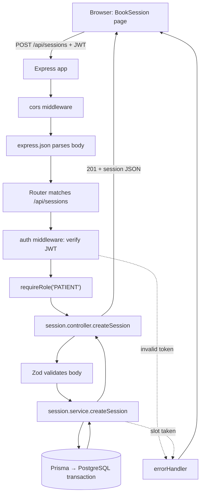
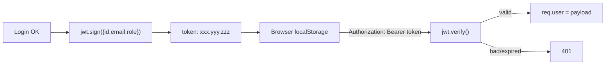
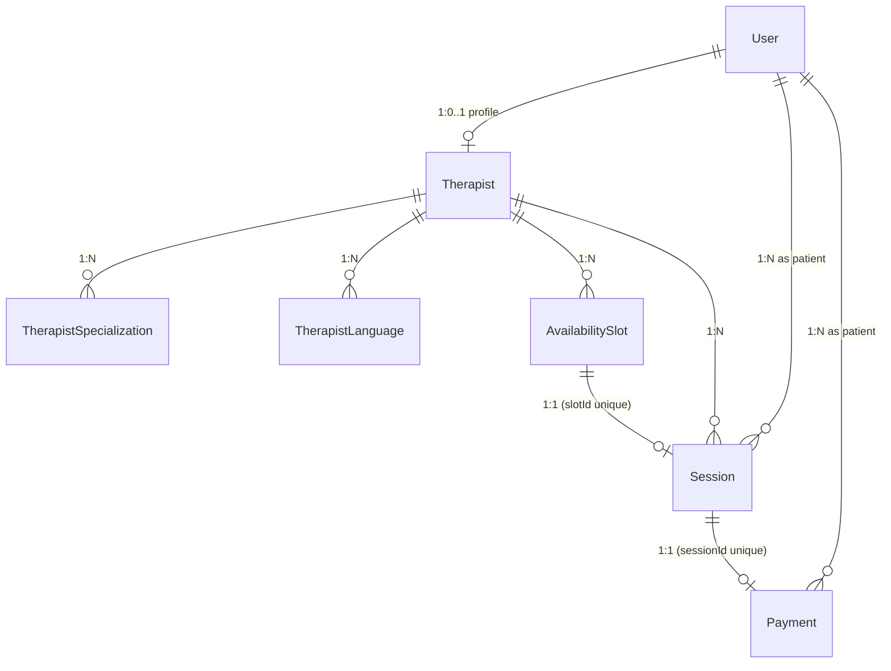
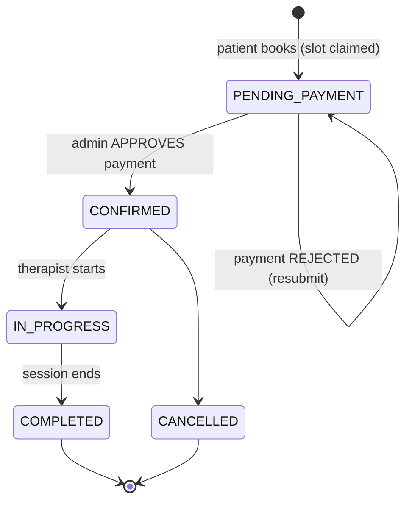

# Concepts Explained — MindBridge

> A from-scratch teaching guide to **every important concept** used in the MindBridge
> codebase. Written for a Computer Science student. Each concept follows the same
> shape: **What it is → Why it exists → Why we need it → How it works → Where we use
> it → What would happen without it.**

> **Stack note (read this first).** Some tutorials assume a MERN stack (MongoDB +
> Mongoose + Axios). **MindBridge does not use those.** It uses:
> - **PostgreSQL** (a *relational* SQL database) — not MongoDB.
> - **Prisma** (a type-safe ORM/query builder) — not Mongoose.
> - The browser's built-in **`fetch`** wrapped in a small client — not Axios.
>
> So below, where a generic course would teach "MongoDB concepts" and "Mongoose
> concepts", this guide teaches **PostgreSQL** and **Prisma**, because that is what
> you will actually touch in this repository. The *ideas* (databases, relationships,
> an ORM, an HTTP client) transfer; the *tools* are different.

---

## Table of Contents

1. [The Client–Server Model](#1-the-clientserver-model)
2. [REST APIs](#2-rest-apis)
3. [HTTP Methods & Status Codes](#3-http-methods--status-codes)
4. [The Request Lifecycle](#4-the-request-lifecycle)
5. [Middleware](#5-middleware)
6. [Authentication](#6-authentication)
7. [Password Hashing (bcrypt)](#7-password-hashing-bcrypt)
8. [JWT (JSON Web Tokens)](#8-jwt-json-web-tokens)
9. [Authorization & Role-Based Access Control (RBAC)](#9-authorization--role-based-access-control-rbac)
10. [Protected Routes](#10-protected-routes)
11. [Validation (Zod)](#11-validation-zod)
12. [Error Handling](#12-error-handling)
13. [Promises](#13-promises)
14. [Async / Await](#14-async--await)
15. [PostgreSQL — the Relational Database](#15-postgresql--the-relational-database)
16. [Prisma — the ORM](#16-prisma--the-orm)
17. [Database Relationships](#17-database-relationships)
18. [Database Transactions & Race Conditions](#18-database-transactions--race-conditions)
19. [React: Components, State & Hooks](#19-react-components-state--hooks)
20. [React Context & State Management](#20-react-context--state-management)
21. [API Communication (the `fetch` client)](#21-api-communication-the-fetch-client)
22. [The Adapter Pattern](#22-the-adapter-pattern)
23. [Scheduling / Slot Logic](#23-scheduling--slot-logic)
24. [Therapist Booking Logic](#24-therapist-booking-logic)
25. [Money Handling](#25-money-handling)
26. [Idempotency](#26-idempotency)
27. [Security Concepts (cross-cutting)](#27-security-concepts-cross-cutting)

---

## 1. The Client–Server Model

**What it is.** Two programs talking over a network: a **client** (the React app in
the user's browser) asks for things; a **server** (the Express API) answers.

**Why it exists.** The browser cannot be trusted with the database, secrets, or
business rules — anyone can open DevTools and tamper with it. So we split the system:
the *untrusted* presentation lives on the client, the *trusted* logic and data live on
the server.

**Why we need it.** Multiple users (patients, therapists, admins) must share **one**
source of truth (the database). A central server is that shared brain.

**How it works.** The client sends an HTTP **request** (a text message with a method,
URL, headers, and optional body). The server sends back an HTTP **response** (a status
code + headers + body). They never share memory — only messages.

**Analogy.** A restaurant. You (client) read a menu and place an order with a waiter.
The kitchen (server) cooks and the waiter brings back a plate (response). You never
walk into the kitchen; you never see the raw ingredients (the database).

**Where in our project.**
- Client: everything under [Frontend/src/](../Frontend/src/) (runs in the browser, port `5173` in dev).
- Server: everything under [Backend/src/](../Backend/src/) (runs on Node.js, port `5000`).
- They are completely separate programs that only talk via HTTP JSON.

**Without it.** You'd have to put the database password and all logic in the browser —
a catastrophic security hole, and no way for two users to see the same data.

---

## 2. REST APIs

**What it is.** **REST** (REpresentational State Transfer) is a *convention* for
designing an HTTP API around **resources** (nouns) addressed by URLs, manipulated with
HTTP **verbs**.

**Why it exists.** Before conventions, every API invented its own ad-hoc shape. REST
gave teams a predictable, uniform vocabulary so a new developer can guess how an API
behaves.

**Why we need it.** MindBridge has resources: *therapists, sessions, payments, users*.
REST lets us expose them in an obvious, consistent way.

**How it works.** A resource gets a base URL; the verb decides the action:

| Intention | Verb + URL | MindBridge example |
|---|---|---|
| List a collection | `GET /api/therapists` | browse therapists |
| Read one item | `GET /api/sessions/:id` | view one session |
| Create | `POST /api/sessions` | book a session |
| Partial update | `PATCH /api/payments/:id/approve` | admin approves a payment |

**Analogy.** A well-organised library. Books (resources) sit at predictable shelf
addresses (URLs). "Borrow", "return", "read" are the verbs. You don't need a map for
every book — the system is uniform.

**Where in our project.** Every backend route file is a REST resource:
[auth.routes.js](../Backend/src/routes/auth.routes.js),
[therapist.routes.js](../Backend/src/routes/therapist.routes.js),
[session.routes.js](../Backend/src/routes/session.routes.js),
[payment.routes.js](../Backend/src/routes/payment.routes.js),
[admin.routes.js](../Backend/src/routes/admin.routes.js).
All are mounted under `/api/...` in [index.js](../Backend/src/index.js).

**Without it.** Endpoints would be inconsistent (`/getTherapistList`, `/doBooking`,
`/payApprove2`) — harder to learn, document, and maintain.

---

## 3. HTTP Methods & Status Codes

**What it is.** The **method** is the *verb* of a request (`GET`, `POST`, `PATCH`,
`DELETE`). The **status code** is a 3-digit number the server returns to say how it
went.

**Why it exists / why we need it.** They give a shared, machine-readable language for
"what do you want?" and "how did it go?" — so the client can react correctly (show
data, show an error, redirect to login) without parsing English.

**How it works — the status families we use:**

| Code | Meaning | Where MindBridge returns it |
|---|---|---|
| `200 OK` | Success (read/update) | login, list therapists, approve payment |
| `201 Created` | A new row was made | register, book session, submit payment |
| `400 Bad Request` | Your input failed validation | Zod rejects a malformed body |
| `401 Unauthorized` | You are not logged in / bad token | missing or expired JWT |
| `403 Forbidden` | Logged in, but not allowed | patient hitting an admin route |
| `404 Not Found` | No such thing | unknown therapist id, unmatched route |
| `409 Conflict` | Clashes with current state | slot already booked, double payment |
| `500 Server Error` | We crashed | unhandled exception |

**Analogy.** Traffic lights for software. `2xx` green (go), `4xx` "you made a mistake"
(your fault), `5xx` "we made a mistake" (our fault).

**Where in our project.** Controllers choose the success code (e.g. `res.status(201)`
in [session.controller.js](../Backend/src/controllers/session.controller.js)); services
throw errors carrying a `.status` (e.g. `error.status = 409` in
[session.service.js](../Backend/src/services/session.service.js)); the
[errorHandler.js](../Backend/src/middleware/errorHandler.js) translates those into the
final response.

**Without it.** The client couldn't tell success from failure, or *whose* fault a
failure was, so it couldn't decide whether to retry, show a message, or log the user
out.

---

## 4. The Request Lifecycle

**What it is.** The ordered journey of a single request from the browser, through the
server's layers, to the database, and back.

**Why it exists / need it.** Understanding the order is the single most useful mental
model for debugging: when something breaks, you ask *"how far down the pipe did it
get?"*

**How it works (a real MindBridge example — booking a session):**



**Analogy.** An airport. Check-in (CORS), security (auth), boarding-pass scan
(requireRole), gate agent (controller/validation), the flight itself (service + DB),
and arrival back home (response). Fail any checkpoint and you're turned around early
(error handler).

**Where in our project.** The pipeline is assembled in
[index.js](../Backend/src/index.js); per-route checkpoints are attached in the route
files. See [request-flow.md](./request-flow.md) for every feature traced end-to-end.

**Without it.** You'd debug blindly. Knowing the lifecycle tells you exactly which file
to open when a request returns 401 vs 400 vs 500.

---

## 5. Middleware

**What it is.** A function that sits **in the middle** of the request pipeline. In
Express it has the signature `(req, res, next)`. It can inspect/modify the request,
end it early, or call `next()` to pass control to the next function.

**Why it exists.** Many routes need the *same* preliminary work — parse JSON, check a
token, check a role, handle errors. Middleware lets you write that once and reuse it,
instead of copy-pasting into every handler.

**Why we need it.** MindBridge has ~20 endpoints; almost all need JSON parsing and most
need auth. Middleware keeps that DRY (Don't Repeat Yourself).

**How it works.** Express runs middleware **in the order you register it**. Each one
either responds (ending the chain) or calls `next()`. A special 4-argument form
`(err, req, res, next)` is the **error handler**, which Express jumps to whenever
`next(err)` is called.

```js
// A chain on one route (Backend/src/routes/session.routes.js):
router.post('/', auth, requireRole('PATIENT'), createSession)
//               ↑      ↑                        ↑
//          is logged   is a patient        do the work
//             in?
```

**Analogy.** A series of bouncers outside a club, each checking one thing (ID, dress
code, guest list). Pass all of them and you're inside (the controller). Fail one and
you're stopped at that door.

**Where in our project.**
- App-wide: `cors()` and `express.json()` in [index.js](../Backend/src/index.js).
- Route-level: [auth.js](../Backend/src/middleware/auth.js) (verify JWT) and
  [requireRole.js](../Backend/src/middleware/requireRole.js) (check role).
- Last of all: [errorHandler.js](../Backend/src/middleware/errorHandler.js).

**Without it.** Every controller would repeat token parsing, role checks, and
try/catch error formatting — dozens of duplicated, drift-prone copies.

---

## 6. Authentication

**What it is.** Proving **who you are** ("authn"). Logging in.

**Why it exists.** The server must know which user is making a request so it can show
*their* sessions, not someone else's.

**Why we need it.** Patients, therapists, and admins must be told apart, and a stranger
must not be able to read a patient's therapy history.

**How it works in MindBridge (token-based):**
1. You `POST /api/auth/login` with email + password.
2. The server checks the password against a stored **hash** (see §7).
3. If correct, it issues a signed **JWT** (see §8) that encodes your identity.
4. The browser stores the token and attaches it to every later request.
5. The server verifies the token instead of asking for your password again.

**Analogy.** A concert. You show your ID once at the entrance (login) and get a
wristband (token). For the rest of the night you flash the wristband, not your ID.

**Where in our project.**
- Service: [auth.service.js](../Backend/src/services/auth.service.js) (`loginUser`,
  `registerUser`).
- Token storage + restore on the client:
  [RoleContext.jsx](../Frontend/src/context/RoleContext.jsx) and the
  `getToken/setToken` helpers in [api.js](../Frontend/src/services/api.js).

**Without it.** Anyone could view or act as anyone. No privacy, no accountability.

---

## 7. Password Hashing (bcrypt)

**What it is.** Turning a password into an irreversible scrambled string (a **hash**)
before storing it. We use the **bcrypt** algorithm.

**Why it exists.** Databases get breached. If you store raw passwords, a breach hands
attackers every user's password (and, because people reuse passwords, their other
accounts too).

**Why we need it.** It is an ethical and legal baseline. We must never be *able* to see
a user's password — even we shouldn't know it.

**How it works.**
- `bcrypt.hash(password, 10)` runs the password through a deliberately *slow* function
  (the `10` = "cost"/salt rounds, 2¹⁰ iterations) and bakes in a random **salt**.
- The salt means two users with the same password get **different** hashes (so you
  can't spot duplicates).
- To log in, `bcrypt.compare(plain, storedHash)` re-runs the math and checks for a
  match — it never "decrypts" anything, because hashing is one-way.
- Slowness is the point: it makes brute-forcing millions of guesses expensive.

**Analogy.** A blender. You can blend fruit into a smoothie (hash), but you can never
un-blend the smoothie back into fruit (no decryption). To check "was this the same
apple?", you blend a new apple the same way and compare smoothies.

**Where in our project.** [auth.service.js](../Backend/src/services/auth.service.js)
(`bcrypt.hash` on register, `bcrypt.compare` on login) and
[seed.js](../Backend/prisma/seed.js) (seeded users get hashed passwords too). The
hashed value is stored as `User.passwordHash`; it is **stripped** from every API
response by `sanitizeUser`.

**Without it.** A single database leak = every patient's password exposed in plain
text. Indefensible.

---

## 8. JWT (JSON Web Tokens)

**What it is.** A compact, **signed** token that carries a small JSON payload. Format:
three Base64 parts separated by dots — `header.payload.signature`.

**Why it exists.** HTTP is **stateless** — the server forgets you the instant a request
ends. We need a way to carry "I already logged in" across requests **without** the
server storing a session for everyone.

**Why we need it.** It lets the API stay stateless and simple: no server-side session
table, no shared session store. The token itself proves identity.

**How it works.**
- On login we call `jwt.sign({ id, email, role }, JWT_SECRET, { expiresIn: '7d' })`.
- The **signature** is a cryptographic stamp made with our secret key. Anyone can
  *read* the payload (it is not encrypted!), but nobody can *forge* or *alter* it
  without the secret.
- On each protected request, the client sends `Authorization: Bearer <token>`. The
  server runs `jwt.verify(token, JWT_SECRET)`; if the signature checks out and it
  hasn't expired, it trusts the payload and sets `req.user = { id, email, role }`.



**Analogy.** A tamper-proof festival wristband with your name printed on it. Staff can
*read* your name at a glance (payload is public), but the special hologram (signature)
means you can't make a fake one at home.

> ⚠️ **Because the payload is readable, never put secrets in a JWT.** MindBridge only
> puts `id`, `email`, `role` — nothing sensitive.

**Where in our project.** Signed in
[auth.service.js](../Backend/src/services/auth.service.js); verified in
[middleware/auth.js](../Backend/src/middleware/auth.js); stored/attached in
[api.js](../Frontend/src/services/api.js) (`mindbridge_token` in `localStorage`).

**Without it.** We'd need server-side sessions (more infrastructure) or we'd send the
password on every request (terrible). JWTs give stateless, scalable auth.

**Known trade-offs in our build (be honest):** the token lives 7 days with no refresh
rotation, and `logout` is client-side only (we delete the token; the server can't
revoke a still-valid one). Fine for this project; a production app would add refresh
tokens and/or a revocation list.

---

## 9. Authorization & Role-Based Access Control (RBAC)

**What it is.** Authorization ("authz") decides **what you're allowed to do** *after*
we know who you are. **RBAC** is the strategy of attaching permissions to **roles**
(`PATIENT`, `THERAPIST`, `ADMIN`) rather than to individuals.

**Why it exists / need it.** Different users may do different things: only admins
approve payments; only patients book sessions; only a session's own therapist sets its
Zoom link. We must enforce that on the **server**, where it can't be bypassed.

**How it works — two complementary layers:**
1. **Role gate (coarse).** The `requireRole(...roles)` middleware rejects with `403`
   if `req.user.role` isn't in the allowed list. Example:
   `requireRole('ADMIN')` on every `/api/admin/*` route.
2. **Ownership check (fine).** Even the right *role* shouldn't touch *another person's*
   data. Services verify ownership: e.g. `assertCanAccessSession` lets a patient read
   only their own session; `setZoomLink` lets a therapist edit only sessions that
   belong to them.

```js
// Coarse gate (route) + fine check (service)
router.patch('/:id/zoom', auth, requireRole('THERAPIST','ADMIN'), setSessionZoomLink)
// inside the service:
if (requester.role !== 'ADMIN' && session.therapist.userId !== requester.id) {
  const error = new Error('You can only update your own sessions.'); error.status = 403; throw error
}
```

**Analogy.** A hospital badge. Authentication = the badge proves you're Dr. Khan.
Authorization (role) = your badge opens the surgery wing but not payroll. Ownership =
even in the records room, you may open *your* patients' files, not every file.

**Where in our project.** [requireRole.js](../Backend/src/middleware/requireRole.js) on
the protected routes; ownership logic inside
[session.service.js](../Backend/src/services/session.service.js) and
[payment.service.js](../Backend/src/services/payment.service.js).

**Without it.** Any logged-in patient could approve their own payment or read every
patient's therapy notes. Authentication alone is not enough — **authz is where the real
security lives.**

---

## 10. Protected Routes

**What it is.** Routes that refuse to serve unless conditions are met. There are **two
independent kinds** here, and conflating them is a classic beginner mistake.

**(a) Backend protected routes — the real security.**
Enforced by `auth` + `requireRole` middleware on the server. The browser cannot skip
these. This is what actually protects data.

**(b) Frontend protected routes — UX only.**
The React `<ProtectedRoute>` component checks the user's role in context and redirects
to `/login` if it doesn't match. This is *not* security — a determined user can edit
client code. Its job is **user experience**: don't show a patient a broken admin screen.

**Why both exist.** The backend gate keeps data safe; the frontend gate keeps the UI
coherent. They look similar but serve different masters.

**How the frontend one works:**
```jsx
// Frontend/src/components/ProtectedRoute.jsx
if (loading) return <Loading/>            // wait while we restore the session
if (allowedRoles.includes(role)) return children
return <Navigate to="/login" replace />
```
The `loading` guard is subtle but important: on a page refresh we must *wait* while we
re-verify the stored token via `/auth/me`, otherwise we'd wrongly bounce a logged-in
user to login. (See [RoleContext.jsx](../Frontend/src/context/RoleContext.jsx).)

**Analogy.** Backend gate = the locked vault door. Frontend gate = a "Staff Only" sign
on a corridor. The sign keeps honest people out and tidy; the vault door is what
actually stops a thief.

**Where in our project.** Backend: every `session/payment/admin` route. Frontend:
[App.jsx](../Frontend/src/App.jsx) wraps `/book/:id`, `/payment/:id`, and the three
`/dashboard/*` routes in `<ProtectedRoute>`.

**Without it.** No backend gate → data breach. No frontend gate → users see screens
that 401 everywhere and feel broken.

---

## 11. Validation (Zod)

**What it is.** Checking that incoming data has the right shape/type/limits **before**
you use it. We use **Zod**, a schema library.

**Why it exists.** *Never trust the client.* Bodies can be missing fields, wrong types,
absurd lengths, or maliciously crafted. Validation is the gatekeeper.

**Why we need it.** It turns vague failures deep in the code (or a database crash) into
a clean, early, descriptive `400`.

**How it works.** You declare a schema; `schema.safeParse(body)` returns either
`{ success:true, data }` (cleaned, typed) or `{ success:false, error }` (with per-field
messages). Zod can also **transform** — e.g. lowercasing emails, trimming whitespace.

```js
// Backend/src/validators/auth.validator.js
export const registerSchema = z.object({
  name:     z.string().min(2).max(100).trim(),
  email:    z.string().email().trim().transform(v => v.toLowerCase()),
  password: z.string().min(8).max(100),
  role:     z.enum(['PATIENT','THERAPIST']).default('PATIENT'),
})
```
Controllers then do:
```js
const parsed = registerSchema.safeParse(req.body)
if (!parsed.success) return res.status(400).json({ error:'Validation failed', details:[...] })
```

**Analogy.** A nightclub's ID check at the door. Wrong format, underage, or no ID →
turned away immediately, with a clear reason — before you ever reach the bar.

**Where in our project.** [validators/](../Backend/src/validators/): `auth.validator.js`,
`session.validator.js`, `payment.validator.js`. Used by their matching controllers.

> Note: the public therapist **filter** query params (`?maxFee=...`) are *not* Zod-
> validated — a known minor gap noted in the architecture doc.

**Without it.** Garbage data reaches the database; you get cryptic 500s, corrupt rows,
or injection-style abuse instead of a tidy 400 with a helpful message.

---

## 12. Error Handling

**What it is.** A consistent strategy for what happens when something goes wrong, so
failures become predictable JSON instead of crashes or leaks.

**Why it exists / need it.** Errors are inevitable (bad input, missing rows, DB
hiccups). Handling them in one place keeps responses uniform and prevents leaking stack
traces to users.

**How it works in MindBridge — a clean three-step pattern:**
1. **Services throw** a normal `Error` with a numeric `.status` attached:
   ```js
   const error = new Error('Slot has already been booked.'); error.status = 409; throw error
   ```
2. **Controllers catch** and forward, never formatting the error themselves:
   ```js
   try { ... } catch (err) { next(err) }
   ```
3. **One global handler** formats every error the same way:
   ```js
   // Backend/src/middleware/errorHandler.js
   res.status(err.status || 500).json({
     error: err.message || 'Internal server error',
     ...(NODE_ENV === 'development' && { stack: err.stack }),  // stack ONLY in dev
   })
   ```

**Analogy.** A hospital triage desk. No matter which department a problem comes from,
everything funnels through one desk that records it consistently and hands the patient a
clear, uniform discharge note.

**Where in our project.** The pattern is used in *every* service/controller pair; the
funnel is [errorHandler.js](../Backend/src/middleware/errorHandler.js), registered
**last** in [index.js](../Backend/src/index.js).

**Without it.** Each endpoint would format errors differently (or crash the process);
stack traces could leak to users; the frontend couldn't rely on a stable
`{ error: "message" }` shape.

---

## 13. Promises

**What it is.** A JavaScript object representing a value that **will exist later** — the
result of an asynchronous operation. It's in one of three states: *pending → fulfilled*
or *pending → rejected*.

**Why it exists.** JavaScript is **single-threaded**: it does one thing at a time. Slow
work (network, disk, database) must not *block* that single thread, or the whole program
freezes. Promises represent "this is in flight; I'll tell you when it's done."

**Why we need it.** Every database query and every `fetch` is asynchronous. Promises are
how we manage their eventual results without freezing.

**How it works.** A promise resolves with a value (`.then`) or rejects with an error
(`.catch`). `Promise.all([...])` runs several **in parallel** and waits for all.

```js
// Frontend/src/pages/AdminConsole.jsx — three calls fired together, not one-by-one:
Promise.all([api.getAdminStats(), api.getAdminPayments(), api.getAdminUsers()])
  .then(([stats, payments, users]) => { ... })
```

**Analogy.** A coat-check ticket. You hand over your coat (start the async work) and
get a ticket (the promise) immediately — you don't stand frozen at the counter. Later
you redeem the ticket for the coat (`.then`), or learn it was lost (`.catch`).

**Where in our project.** Every Prisma call (`await prisma.user.findUnique(...)`) and
every client API call returns a promise. `Promise.all` powers the admin dashboard's
parallel load and the backend stats aggregation in
[admin.service.js](../Backend/src/services/admin.service.js).

**Without it.** We'd be stuck with old "callback hell" (deeply nested callbacks) or a
frozen UI while waiting on the network.

---

## 14. Async / Await

**What it is.** Syntactic sugar over Promises that lets you write asynchronous code that
*reads* like synchronous, top-to-bottom code.

**Why it exists.** `.then().then().catch()` chains get hard to read. `async/await` makes
the same logic linear and lets you use normal `try/catch`.

**How it works.** Mark a function `async`; inside it, `await` a promise to pause *that
function* until the promise settles (the thread keeps doing other work meanwhile).

```js
// Backend/src/services/auth.service.js (the SAME logic, readable):
export const loginUser = async ({ email, password }) => {
  const user = await prisma.user.findUnique({ where: { email } })   // pause here
  if (!user) { const e = new Error('Invalid email or password.'); e.status = 401; throw e }
  const ok = await bcrypt.compare(password, user.passwordHash)      // and here
  if (!ok)  { const e = new Error('Invalid email or password.'); e.status = 401; throw e }
  return { user: sanitizeUser(user), token: signToken({ id:user.id, email, role:user.role }) }
}
```

**Analogy.** A recipe written as numbered steps ("wait for the water to boil, *then*
add pasta"), instead of a tangle of "when X finishes, do Y; when Y finishes, do Z"
sticky notes.

**Where in our project.** Essentially every service and controller function is `async`,
and every DB/`fetch` call is `await`ed. `try/catch` around `await` is how controllers
funnel errors to `next(err)`.

**Without it.** The same behaviour, but in nested `.then()` chains that are far harder
to read and to wrap in error handling.

---

## 15. PostgreSQL — the Relational Database

> *(This is what a generic course calls "MongoDB concepts" — but MindBridge uses a
> **relational SQL** database, not a document database. Here is the version that
> matches our code.)*

**What it is.** **PostgreSQL** ("Postgres") is a relational database: data lives in
**tables** (like spreadsheets) with fixed **columns** and **typed** rows. Tables link to
each other through **keys**.

**Why it exists / need it.** Our data is highly **relational**: a Session belongs to a
Patient *and* a Therapist *and* a Slot, and has one Payment. Relational databases are
built to model and enforce exactly these connections, with strong guarantees.

**How it works — vocabulary:**

| Term | Meaning | MindBridge example |
|---|---|---|
| Table | a collection of rows | `users`, `sessions`, `payments` |
| Row / record | one entry | one user |
| Column / field | one attribute | `email`, `feePkr` |
| Primary key (PK) | unique row id | every `id` is a UUID |
| Foreign key (FK) | a column pointing at another table's PK | `Session.patientId → User.id` |
| Unique constraint | "no duplicates allowed" | `User.email`, `Payment.sessionId` |
| Enum | a fixed set of allowed values | `Role`, `SessionStatus`, `PaymentStatus` |

**ACID guarantees** (why we trust it with money/bookings): **A**tomic (all-or-nothing),
**C**onsistent (constraints always hold), **I**solated (concurrent ops don't corrupt
each other), **D**urable (committed = saved). These power our booking/payment safety
(see §18).

**Analogy.** A well-designed set of linked spreadsheets where the software *refuses* to
let you type a therapist id that doesn't exist, or book the same slot twice. The rules
are enforced by the database itself, not just hoped for in code.

**Where in our project.** Configured in
[schema.prisma](../Backend/prisma/schema.prisma) (`provider = "postgresql"`); connection
string is `DATABASE_URL`. Seven tables: `users`, `therapists`,
`therapist_specializations`, `therapist_languages`, `availability_slots`, `sessions`,
`payments`.

**Without it.** With a loosely-typed store you'd hand-maintain every relationship and
uniqueness rule in application code — and inevitably let bad data slip in (orphaned
sessions, double bookings, duplicate emails).

---

## 16. Prisma — the ORM

> *(This is what a generic course calls "Mongoose concepts." MindBridge's ORM is
> **Prisma**, used with PostgreSQL.)*

**What it is.** **Prisma** is an **ORM** (Object-Relational Mapper): a library that lets
you read/write the database using **JavaScript methods and objects** instead of writing
raw SQL strings. It also generates a typed client from your schema.

**Why it exists / need it.** Hand-writing SQL is verbose and error-prone (typos,
injection risks, no autocomplete). Prisma gives a safe, ergonomic, consistent API and a
**single source of truth** — the schema file — for both the database structure and the
client code.

**How it works — three pieces:**
1. **`schema.prisma`** declares models (tables) and relations. One model per table.
2. **Migrations** turn schema changes into SQL that builds/updates the real database
   (`prisma migrate`). Our one migration is `20260504184846_init`.
3. **The generated client** gives methods like `findMany`, `findUnique`, `create`,
   `update`, `updateMany`, `count`, `groupBy`, `aggregate`, and `$transaction`.

```js
// Prisma reads like JS objects, not SQL strings:
const therapists = await prisma.therapist.findMany({
  where:   { isActive: true, feePkr: { lte: 5000 } },
  include: { user: true, specializations: true, languages: true },
  orderBy: { rating: 'desc' },
})
```

Two features we lean on heavily:
- **`include`/`select`** — pull related rows in one query (a Session *with* its
  patient, therapist, slot, payment) and choose exactly which columns come back (so we
  can omit `passwordHash`).
- **Relation filters** — query a table by a related table's field, e.g. *"sessions
  whose therapist has this `userId`"*: `where: { therapist: { userId } }`.

**Analogy.** A skilled translator between two languages. You speak JavaScript ("give me
active therapists under PKR 5000, sorted by rating"); Prisma speaks fluent SQL to
Postgres and translates the reply back into JS objects.

**Where in our project.** One shared client in
[config/db.js](../Backend/src/config/db.js) (a **singleton** — one connection pool for
the whole app). Every service imports it. The `formatTherapist` / `formatSession` /
`formatPayment` helpers then reshape Prisma's nested results into clean client JSON.

**Without it.** Raw SQL everywhere: more code, injection risk, no type safety, and the
schema and queries could silently drift out of sync.

---

## 17. Database Relationships

**What it is.** The wiring between tables. Three shapes appear in MindBridge: **one-to-
one (1:1)**, **one-to-many (1:N)**, and the read-only **many-to-many-ish** via child
tables.

**Why it exists / need it.** Real entities are connected. Storing them separately and
linking by keys (instead of duplicating data everywhere) keeps data consistent and
non-redundant — the heart of relational design (**normalization**).

**How it works — our actual relationships:**



| Shape | Example | How it's enforced |
|---|---|---|
| **1:1** | a `User` has at most one `Therapist` profile | `Therapist.userId` is **unique** |
| **1:1** | a `Session` has at most one `Payment` | `Payment.sessionId` is **unique** |
| **1:1** | a `Slot` is used by at most one `Session` | `Session.slotId` is **unique** |
| **1:N** | a `User` (patient) has many `Session`s | FK `Session.patientId` |
| **1:N** | a `Therapist` has many `AvailabilitySlot`s | FK `AvailabilitySlot.therapistId` |
| **1:N** | a `Therapist` has many specializations/languages | child tables |

The **unique foreign key** is the trick that turns a 1:N into a 1:1. Because
`Payment.sessionId` is unique, a session physically cannot have two payments.

**Analogy.** Family trees and ID cards. Instead of writing your mother's full life story
on your birth certificate (duplication), the certificate just references her ID
(foreign key). Update her details once, and every reference stays correct.

**Where in our project.** All declared in
[schema.prisma](../Backend/prisma/schema.prisma) via `@relation`, `@unique`, and the
child models. Used everywhere through Prisma `include`.

**Without it.** You'd duplicate therapist details into every session row, then fight to
keep copies in sync — and nothing would stop two payments for one session.

---

## 18. Database Transactions & Race Conditions

**What it is.** A **transaction** groups several database operations so they **all
succeed or all fail together** — never half-done. A **race condition** is a bug where
two requests interleave at the wrong moment and corrupt shared state (e.g. two patients
booking the same slot at the same millisecond).

**Why it exists / need it.** Booking and payment touch *multiple* rows that must stay
consistent. If the server crashes mid-way, we must not end up with a session that has no
slot, or a slot marked booked with no session.

**How it works in MindBridge:**

**(a) Atomic slot claiming (prevents double-booking).** Instead of "read slot → if free,
book it" (two requests could both read "free"), we do a **conditional update** inside a
transaction:
```js
// Backend/src/services/session.service.js
const claimed = await tx.availabilitySlot.updateMany({
  where: { id: slotId, isBooked: false },  // only updates if STILL free
  data:  { isBooked: true },
})
if (claimed.count === 0) { /* someone beat us to it */ throw 409 }
// ...then create the Session in the SAME transaction
```
The database guarantees only **one** request's `updateMany` can flip `false→true`; the
loser gets `count === 0` and a clean `409`.

**(b) Approve payment + confirm session together.** Approving a payment must also confirm
its session. Both happen in one `$transaction`, so they can never drift apart:
```js
// Backend/src/services/payment.service.js
await prisma.$transaction(async (tx) => {
  await tx.payment.update({ where:{id}, data:{ status:'APPROVED', approvedAt:new Date() }})
  await tx.session.update({ where:{id:payment.sessionId}, data:{ status:'CONFIRMED' }})
})
```

**Analogy.** A bank transfer. Debiting one account and crediting another must be one
indivisible act. If the power dies after the debit but before the credit, money would
vanish. A transaction makes it all-or-nothing.

**Where in our project.** [session.service.js](../Backend/src/services/session.service.js)
(`createSession`) and [payment.service.js](../Backend/src/services/payment.service.js)
(`approvePayment`).

**Without it.** Two patients could book the same therapist for the same time; or an
admin "approval" could mark the payment paid while the session stayed unconfirmed.
Money + scheduling bugs are the worst kind — transactions prevent them.

---

## 19. React: Components, State & Hooks

**What it is.** **React** builds UIs from **components** — JavaScript functions that
return markup (JSX). **State** is a component's memory; **hooks** (`useState`,
`useEffect`) are functions that let a component use React features.

**Why it exists / need it.** Manually poking the DOM (`document.getElementById...`) gets
unmanageable. React lets you *describe* what the UI should look like for a given state,
and it updates the screen for you when state changes.

**How it works.**
- `useState` holds data that can change; calling its setter **re-renders** the component.
- `useEffect(fn, [deps])` runs *side effects* (like fetching data) after render, and
  re-runs when a dependency changes. `[]` = run once on mount.

```jsx
// Frontend/src/pages/Therapists.jsx — fetch once, store in state, render
const [therapists, setTherapists] = useState([])
const [loading, setLoading] = useState(true)
useEffect(() => {
  api.getTherapists().then(setTherapists).finally(() => setLoading(false))
}, [])  // [] → run once when the page mounts
```

**Analogy.** A spreadsheet with formulas. You change one input cell (state); every cell
that depends on it recalculates automatically (re-render). You don't manually rewrite
each dependent cell.

**Where in our project.** Every file under [Frontend/src/pages/](../Frontend/src/pages/)
and [components/](../Frontend/src/components/). The dashboards use `useEffect` to load
real data and `useState` for tabs, forms, and async button states.

**Without it.** Manual, brittle DOM manipulation and a tangle of "when this changes,
remember to also update that" code.

---

## 20. React Context & State Management

**What it is.** **Context** is React's built-in way to share state across many
components **without** passing props through every intermediate level ("prop
drilling"). **State management** is the broader discipline of deciding *where* shared
data lives.

**Why it exists / need it.** "Who is logged in and what's their role?" is needed by the
Navbar, every dashboard, ProtectedRoute, and more. Threading that through dozens of
component props would be miserable and fragile.

**How it works.** A `Provider` holds the state at the top of the tree; any descendant
calls a hook to read it directly.

```jsx
// Frontend/src/context/RoleContext.jsx
const RoleContext = createContext(null)
export function RoleProvider({ children }) {
  const [role, setRole] = useState('guest')
  const [currentUser, setCurrentUser] = useState(null)
  const [loading, setLoading] = useState(true)   // true while restoring a saved session
  // login / register / logout live here too
  return <RoleContext.Provider value={{ role, currentUser, login, register, logout, loading }}>
           {children}
         </RoleContext.Provider>
}
export const useRole = () => useContext(RoleContext)
```
Any component then does `const { role, currentUser, logout } = useRole()`.

**Analogy.** A building's public address system. Instead of whispering a message person-
to-person down a hallway (prop drilling), you broadcast once and anyone in the building
can hear it (context).

**Where in our project.** [RoleContext.jsx](../Frontend/src/context/RoleContext.jsx) is
the entire client-side auth state. It is consumed by
[Navbar.jsx](../Frontend/src/components/Navbar.jsx),
[ProtectedRoute.jsx](../Frontend/src/components/ProtectedRoute.jsx),
[Login.jsx](../Frontend/src/pages/Login.jsx), and all three dashboards.

**Without it.** Login state would have to be drilled through every component, or
duplicated and kept in sync manually — exactly the bugs context is designed to remove.

---

## 21. API Communication (the `fetch` client)

> *(A generic course teaches **Axios** here. MindBridge uses the browser's built-in
> **`fetch`**, wrapped in one small helper. Same idea, no extra dependency.)*

**What it is.** The single front-end module that talks to the backend: it builds URLs,
attaches the JWT, sends JSON, and normalises errors — so pages call tidy methods like
`api.getMySessions()` and never touch raw `fetch`.

**Why it exists / need it.** Without a central client, every page would repeat the base
URL, the `Authorization` header, JSON parsing, and error handling — and they'd drift.
One wrapper = one place to change any of it.

**How it works.** A private `request()` helper does the heavy lifting; the exported
`api` object is a catalogue of named endpoints.

```js
// Frontend/src/services/api.js (essence)
async function request(path, { method='GET', body, auth=true } = {}) {
  const headers = {}
  if (body !== undefined) headers['Content-Type'] = 'application/json'
  const token = getToken()
  if (auth && token) headers['Authorization'] = `Bearer ${token}`     // attach JWT
  let res
  try { res = await fetch(`${BASE_URL}${path}`, { method, headers, body: body && JSON.stringify(body) }) }
  catch { const e = new Error('Cannot reach the server.'); e.status = 0; throw e }  // network down
  const data = await res.json().catch(() => null)
  if (!res.ok) { const e = new Error(data?.error || `Request failed (${res.status})`); e.status = res.status; e.details = data?.details; throw e }
  return data
}
```
Key behaviours: token auto-attached from `localStorage`; a *network* failure becomes
`status: 0` (distinct from an HTTP error); non-2xx responses throw an `Error` carrying
`.status` and `.details`, so pages can `catch (err)` and show `err.message`.

**Analogy.** A bilingual concierge for your hotel. You make a simple request in your own
language; the concierge handles the address, the paperwork (headers/token), and reports
back clearly whether it worked — you never deal with the bureaucracy yourself.

**Where in our project.** [api.js](../Frontend/src/services/api.js); imported by every
data-driven page (Home, Therapists, BookSession, Payment, all dashboards) and by
[RoleContext.jsx](../Frontend/src/context/RoleContext.jsx).

**Without it.** Copy-pasted `fetch` boilerplate in ~10 files, inconsistent error
handling, and the token-attachment logic duplicated (and eventually wrong) in several
places.

---

## 22. The Adapter Pattern

**What it is.** A thin translation layer that converts data from one shape into another,
so two components built against different shapes can work together unchanged.

**Why it exists.** The polished React UI was built first, against **mock data** with
fields like `fee`, `reviews`, `image`, and lowercase tracks (`'mental-health'`). The
real backend returns different names: `feePkr`, `reviewCount`, and uppercase enums
(`MENTAL_HEALTH`). Rewriting every component to the new names would be risky and would
**change the UI** (which we were told not to touch).

**Why we need it.** The adapter lets us swap the *data source* (mock → real API) while
leaving the *UI code* alone. It's the seam that made Phase 4B low-risk.

**How it works.** Map the backend object into the shape the UI already expects:
```js
// Frontend/src/services/adapters.js
export function mapTherapist(t) {
  const fee = Number(t.feePkr ?? 0)
  return { ...t, fee, feeDisplay:`PKR ${fee.toLocaleString()}/hr`,
           reviews: t.reviewCount ?? 0,
           track: TRACK_TO_UI[t.track] /* MENTAL_HEALTH → 'mental-health' */,
           specializations: t.specializations || [], languages: t.languages || [] }
}
export function uiTrackToApi(track) { /* 'mental-health' → 'MENTAL_HEALTH' for queries */ }
export function mapUser(u) { /* backend User → currentUser shape for the context */ }
```

**Analogy.** A travel power adapter. Your laptop (UI) has a fixed plug; the foreign wall
socket (API) has a different shape. Rather than rewire the laptop, you slot a cheap
adapter between them and everything just works.

**Where in our project.** [adapters.js](../Frontend/src/services/adapters.js), called
inside [api.js](../Frontend/src/services/api.js) (`mapTherapist`) and
[RoleContext.jsx](../Frontend/src/context/RoleContext.jsx) (`mapUser`).

**Without it.** We'd have had to rename fields across many UI files — more code churn,
higher risk of visual regressions, and a violation of the "don't change the UI"
constraint.

---

## 23. Scheduling / Slot Logic

**What it is.** How available appointment times are represented and offered. Each
bookable time is a row in `AvailabilitySlot` (`therapistId`, `slotDatetime`,
`isBooked`).

**Why it exists / need it.** Patients need to see *real, still-open, future* times for a
specific therapist — not a hardcoded calendar, and never a time that's already passed or
taken.

**How it works.**
- The **seed** generates slots for each therapist: hours `[9,10,11,14,15,16]` for the
  next 7 days (`6 × 7 = 42` slots per therapist).
- The API only ever serves **future, unbooked** slots. The key fix:
  ```js
  // Backend/src/services/therapist.service.js — getTherapistSlots
  where.slotDatetime = date
    ? { gte: start > now ? start : now, lte: end }  // for "today", clamp to now
    : { gte: now }                                   // no date → all future slots
  ```
  So past times are never offered, and *today's* listing hides hours that already
  elapsed.
- The frontend [BookSession.jsx](../Frontend/src/pages/BookSession.jsx) fetches the
  slots, **groups them by date**, and lights up only those days/times on its calendar.

**Analogy.** A barber's appointment book. You can only point at empty rows that are
later than *right now* — yesterday's slots and already-filled rows are simply not on
offer.

**Where in our project.** Generation: [seed.js](../Backend/prisma/seed.js). Serving:
`getTherapistSlots` in [therapist.service.js](../Backend/src/services/therapist.service.js).
Display + grouping: [BookSession.jsx](../Frontend/src/pages/BookSession.jsx).

**Without it.** Patients could try to book times in the past or already-taken slots,
producing failed bookings and a confusing experience.

---

## 24. Therapist Booking Logic

**What it is.** The end-to-end rule set that turns "patient picks a slot" into a real,
paid, confirmed session — safely.

**Why it exists / need it.** Booking touches money and shared resources, so it must be
correct under concurrency and enforce a clear state machine.

**How it works — the session state machine:**



Rules baked into the services:
1. **Book** → creates a `Session` as `PENDING_PAYMENT` and **atomically claims the
   slot** (§18). `patientId` comes from the **JWT**, never the request body.
2. **Pay** → patient submits an EasyPaisa txn id + screenshot; the **amount is derived
   server-side** from the therapist's fee (`fee + 250` service fee), never trusted from
   the client. A previously **rejected** payment can be **reopened** (resubmitted).
3. **Approve** (admin) → payment `APPROVED` **and** session `CONFIRMED`, in one
   transaction. **Reject** → payment `REJECTED`, session stays `PENDING_PAYMENT`.
4. **Zoom** → the session's therapist sets the `zoomLink`; the patient's dashboard then
   shows "Join Session". Terminal states (`COMPLETED`/`CANCELLED`) can't be re-edited.

**Analogy.** Booking a doctor's appointment by bank transfer: you reserve the slot, pay,
the clinic verifies the receipt, *then* your appointment is confirmed and you're sent
the room link. Each step gates the next.

**Where in our project.** [session.service.js](../Backend/src/services/session.service.js)
+ [payment.service.js](../Backend/src/services/payment.service.js) (logic);
[BookSession.jsx](../Frontend/src/pages/BookSession.jsx) →
[Payment.jsx](../Frontend/src/pages/Payment.jsx) →
[AdminConsole.jsx](../Frontend/src/pages/AdminConsole.jsx) →
[TherapistDashboard.jsx](../Frontend/src/pages/TherapistDashboard.jsx) (the UI loop).

**Without it.** Race-condition double-bookings, client-tampered prices, and sessions
that confirm without payment.

---

## 25. Money Handling

**What it is.** How we represent currency. MindBridge stores all amounts as **integer
PKR** (`feePkr`, `amountPkr`, `serviceFee`, `totalPkr`) — whole rupees, no decimals.

**Why it exists / need it.** Floating-point numbers (`0.1 + 0.2 !== 0.3`) are notorious
for rounding errors. For money that's unacceptable. Pakistani rupee pricing here is in
whole rupees, so integers are exact and safe.

**How it works.** The therapist's `feePkr` is the source of truth. At payment time the
server computes `totalPkr = amountPkr + serviceFee` (service fee fixed at `250`). The
client only ever *displays* money (e.g. `PKR ${n.toLocaleString()}`); it never *sets*
the charged amount.

**Analogy.** Counting in cents/paisa rather than fractions of a rupee — you deal in
exact whole units, so the books always balance.

**Where in our project.** Integer money fields in
[schema.prisma](../Backend/prisma/schema.prisma); server-side computation in
`submitPayment` ([payment.service.js](../Backend/src/services/payment.service.js));
display formatting throughout the UI.

**Without it.** Floating-point drift could make totals off by a paisa here and there —
small bugs that are disastrous for a payments system's credibility.

---

## 26. Idempotency

**What it is.** A property where doing an operation **once** and doing it **many times**
produce the **same** end state. "Run again safely."

**Why it exists / need it.** Scripts get re-run; users double-click; networks retry. We
want repeats to be harmless, not to create duplicates or corrupt state.

**How it works — two clear examples:**
- **Seeding** uses `upsert` ("update if exists, else create") keyed on `email`, and
  re-creates only *unbooked* slots. So `npm run seed` can run repeatedly without making
  duplicate users or wiping booked slots:
  ```js
  await prisma.user.upsert({ where:{ email }, update:{}, create:{ ... } })
  await prisma.availabilitySlot.deleteMany({ where:{ isBooked:false } }) // keep booked ones
  ```
- **Payment resubmission** checks the existing payment's status: an `APPROVED` or
  `PENDING` payment is rejected with `409` (no duplicates), while a `REJECTED` one is
  *reopened* to `PENDING` rather than inserting a second row (also guaranteed by the
  unique `Payment.sessionId`).

**Analogy.** A light switch labelled "ON". Flip it once or ten times — the light is ON.
The repeats don't stack up or break anything.

**Where in our project.** [seed.js](../Backend/prisma/seed.js) (upserts + selective slot
reset) and `submitPayment` in
[payment.service.js](../Backend/src/services/payment.service.js).

**Without it.** Re-seeding would crash on duplicate emails or destroy booked slots;
double-clicking "pay" could create two payment rows for one session.

---

## 27. Security Concepts (cross-cutting)

A consolidated checklist of the security ideas already woven through the code, so you
can see them as a *system*:

| Practice | What it does | Where |
|---|---|---|
| **Password hashing** | never store raw passwords | `bcrypt` in [auth.service.js](../Backend/src/services/auth.service.js) |
| **`sanitizeUser`** | strip `passwordHash` from every response | [auth.service.js](../Backend/src/services/auth.service.js); `select` clauses elsewhere |
| **Generic login error** | "Invalid email or password" for *both* unknown email and wrong password | `loginUser` — prevents **user enumeration** |
| **Server-derived identity** | `patientId`/`reviewedBy` taken from the **JWT**, never the body | session & payment controllers |
| **Server-derived amounts** | charge = therapist fee + fixed service fee, computed server-side | `submitPayment` |
| **Validation** | reject malformed input early with `400` | Zod validators |
| **RBAC + ownership** | role gate *and* per-row ownership checks | `requireRole` + service `assert*` checks |
| **Transactions** | no half-finished money/booking state | `$transaction` in session/payment services |
| **Dev-only stack traces** | leak internals only in development | [errorHandler.js](../Backend/src/middleware/errorHandler.js) |
| **Secrets in env** | `JWT_SECRET`, `DATABASE_URL` never hardcoded | `.env` (git-ignored), `.env.example` template |

**Honest known gaps** (documented, not hidden): wide-open `cors()` (no origin allow-
list); 7-day JWT with no refresh/rotation; logout is client-side only (no server-side
revocation); therapist filter query params aren't Zod-validated; payment "screenshot" is
just a filename string (no real file storage). These are appropriate for a learning/
portfolio build and are the natural next hardening steps.

**Analogy.** Security is a *layered* defence (defence in depth), like a castle: a moat
(validation), walls (auth), guards checking badges (RBAC), and a vault inside (ownership
checks + transactions). One layer is never enough; together they're strong.

---

### Where to go next

- For *how these pieces are wired together structurally*, read
  [detailed-architecture.md](./detailed-architecture.md).
- For *each concept traced through a real request*, read
  [request-flow.md](./request-flow.md).
- For *why each was built the way it was*, read
  [phase4A-documentation.md](./phase4A-documentation.md) and
  [phase4B-documentation.md](./phase4B-documentation.md).
