# Detailed Architecture — MindBridge

> Complete system architecture: the high-level shape, the backend, the frontend, the
> database, and a file-by-file breakdown of responsibilities and interactions. Read
> [concepts-explained.md](./concepts-explained.md) first if any term is unfamiliar.

> **Product vs. folder name.** The repository folder is `Sukoon`; every artifact calls
> the product **MindBridge**. They are the same thing.

> **Stack reminder.** Backend = **Node.js + Express + Prisma + PostgreSQL**. Frontend =
> **React + Vite + Tailwind**, talking to the backend over HTTP with the browser's
> **`fetch`**. No MongoDB, no Mongoose, no Axios.

---

## Table of Contents

1. [High-Level Architecture](#1-high-level-architecture)
2. [Folder Structure Breakdown](#2-folder-structure-breakdown)
3. [Backend Architecture](#3-backend-architecture)
4. [Frontend Architecture](#4-frontend-architecture)
5. [Database Architecture](#5-database-architecture)
6. [Authentication Architecture](#6-authentication-architecture)
7. [Authorization Architecture](#7-authorization-architecture)
8. [Scheduling Architecture](#8-scheduling-architecture)
9. [Booking & Payment Architecture](#9-booking--payment-architecture)
10. [State Management Architecture (Frontend)](#10-state-management-architecture-frontend)
11. [File-by-File Reference](#11-file-by-file-reference)
12. [Deployment Architecture](#12-deployment-architecture)

---

## 1. High-Level Architecture

MindBridge is a **two-tier client–server web application** with a classic **layered
backend** and a **single-page-application (SPA) frontend**, sharing one PostgreSQL
database as the single source of truth.

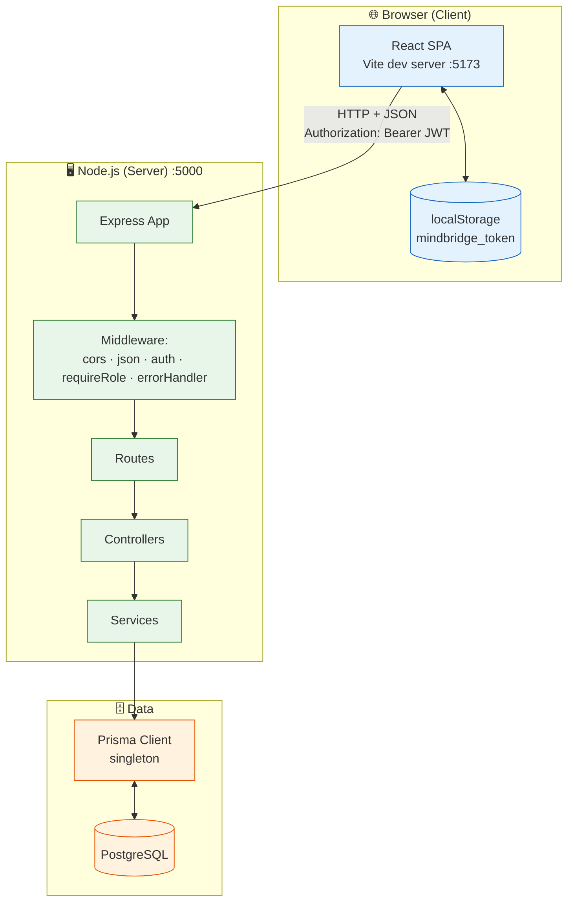

**Key architectural properties:**

| Property | Choice | Rationale |
|---|---|---|
| Tiers | Client + Server + DB | Keep secrets/logic/data server-side |
| Backend style | Layered MVC (Route → Controller → Service → ORM) | Separation of concerns, testability |
| Frontend style | SPA with client-side routing | Fast, app-like navigation |
| Auth | Stateless JWT (Bearer) | No server session store needed |
| Coupling | Decoupled over HTTP/JSON | Either side can change independently |
| Data contract | Backend Prisma shape is canonical; UI adapts | One source of truth + non-invasive integration |

There are **no circular dependencies**. Data flows down (Route→Controller→Service→DB)
and results flow back up; errors short-circuit sideways into the single error handler.

---

## 2. Folder Structure Breakdown

```
Sukoon/
├── Backend/                          # Express + Prisma REST API
│   ├── .env.example                  # DATABASE_URL, PORT, JWT_SECRET, NODE_ENV
│   ├── package.json                  # scripts: dev / start / seed
│   ├── prisma/
│   │   ├── schema.prisma             # 7 models + 4 enums (the domain model)
│   │   ├── seed.js                   # seeds therapists, test users, slots
│   │   └── migrations/
│   │       └── 20260504184846_init/  # the single migration that builds the DB
│   └── src/
│       ├── index.js                  # ENTRY: app, middleware, route mounting, listen
│       ├── config/
│       │   └── db.js                 # singleton PrismaClient
│       ├── routes/                   # URL → controller mapping (+ middleware)
│       │   ├── auth.routes.js
│       │   ├── therapist.routes.js
│       │   ├── session.routes.js
│       │   ├── payment.routes.js
│       │   └── admin.routes.js
│       ├── controllers/              # HTTP layer: parse, validate, shape response
│       │   ├── auth.controller.js
│       │   ├── therapist.controller.js
│       │   ├── session.controller.js
│       │   ├── payment.controller.js
│       │   └── admin.controller.js
│       ├── services/                 # business logic + Prisma queries
│       │   ├── auth.service.js
│       │   ├── therapist.service.js
│       │   ├── session.service.js
│       │   ├── payment.service.js
│       │   └── admin.service.js
│       ├── middleware/
│       │   ├── auth.js               # verify JWT → req.user
│       │   ├── requireRole.js        # RBAC gate
│       │   └── errorHandler.js       # final error formatter
│       └── validators/               # Zod schemas
│           ├── auth.validator.js
│           ├── session.validator.js
│           └── payment.validator.js
│
└── Frontend/                         # React + Vite + Tailwind SPA
    ├── .env.example                  # VITE_API_URL
    ├── index.html  vite.config.js  tailwind.config.js  postcss.config.js
    └── src/
        ├── main.jsx                  # React root mount
        ├── App.jsx                   # Router + RoleProvider + Navbar + route table
        ├── index.css                 # Tailwind layers + shared component classes
        ├── context/
        │   └── RoleContext.jsx       # client-side auth state (the whole "session")
        ├── config/
        │   └── sidebarConfig.jsx     # role-based dashboard navigation definitions
        ├── services/
        │   ├── api.js                # the fetch client (all backend calls)
        │   └── adapters.js           # backend-shape → UI-shape mappers
        ├── data/
        │   └── mockData.js           # leftover mock data (only adminTherapists still used)
        ├── components/
        │   ├── Navbar.jsx  Footer.jsx
        │   ├── TherapistCard.jsx  SidebarLink.jsx
        │   └── ProtectedRoute.jsx
        └── pages/                    # 11 route components
            ├── Home.jsx  Therapists.jsx  TherapistProfile.jsx  CareerTherapy.jsx
            ├── Login.jsx  Register.jsx
            ├── BookSession.jsx  Payment.jsx
            └── PatientDashboard.jsx  TherapistDashboard.jsx  AdminConsole.jsx
```

**The mental rule:** in the backend, responsibility increases as you go *down*
(routes are dumb maps; services hold the brains). In the frontend, `pages/` are
screens, `components/` are reusable parts, `services/` is the backend bridge, and
`context/` is shared state.

---

## 3. Backend Architecture

### 3.1 The layered pattern

Every backend feature follows the same four-layer path. Each layer has **one** job:

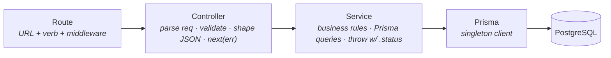

| Layer | Knows about | Does NOT know about | Returns / throws |
|---|---|---|---|
| **Route** | URLs, which middleware, which controller fn | request bodies, DB | — |
| **Controller** | `req`/`res`, validators, status codes | SQL, Prisma | `2xx` JSON or `next(err)` |
| **Service** | business rules, Prisma, the data model | `req`/`res`, HTTP | data, or `Error` with `.status` |
| **Prisma/db** | the database connection | everything above | rows |

**Why this matters:** because services never touch `req`/`res`, the *exact same* service
function (e.g. `getSessionsByPatient`) could be reused by a CLI, a cron job, or a test —
HTTP is just one caller. And because controllers never write SQL, you can change the
database without touching the HTTP layer.

### 3.2 Application bootstrap

[index.js](../Backend/src/index.js) wires the whole server in a fixed order:

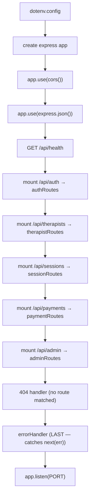

Order is load-bearing: CORS and JSON parsing must run **before** routes; the 404 and
error handlers must be registered **after** all routes (Express tries middleware in
registration order).

### 3.3 The two coexisting code styles

The backend contains two deliberate-looking styles from different build phases:
- **`auth.*` and the Phase-4 `session/payment/admin.*`** files: `export const fn =
  async () => {}`, single quotes, **no semicolons**.
- **`therapist.*`** files: `export async function fn() {}`, **semicolons**.

Both are valid ESM. When editing a file, **match the style already in that file**.
All backend imports use explicit `.js` extensions (required by Node ESM).

---

## 4. Frontend Architecture

### 4.1 SPA composition

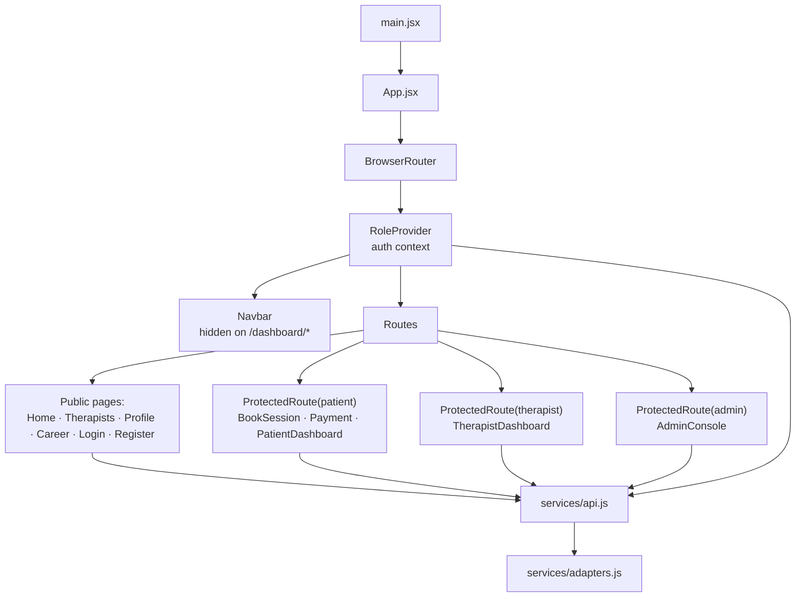

**Top-to-bottom:** `main.jsx` mounts `<App>`; `App` sets up routing + the auth provider
+ a global navbar, then declares the route table. Every data-driven page reaches the
backend exclusively through `services/api.js`, which uses `adapters.js` to reshape
responses. The auth provider (`RoleContext`) sits above everything so any page can read
the current user.

### 4.2 Route table

| Path | Component | Guard |
|---|---|---|
| `/` | Home | public |
| `/login`, `/register` | Login, Register | public |
| `/therapists` | Therapists | public |
| `/therapist/:id` | TherapistProfile | public |
| `/career-therapy` | CareerTherapy | public |
| `/book/:id` | BookSession | `patient` |
| `/payment/:id` | Payment | `patient` (`:id` = **session** id) |
| `/sessions` | → redirect to `/dashboard/patient` | — |
| `/dashboard/patient` | PatientDashboard | `patient` |
| `/dashboard/therapist` | TherapistDashboard | `therapist` |
| `/dashboard/admin` | AdminConsole | `admin` |
| `*` | → redirect to `/` | — |

> **Subtle but important:** `/payment/:id` carries a **session** id, not a therapist id.
> `BookSession` first creates the session (getting its id back), then navigates to
> `/payment/<sessionId>`. This changed in Phase 4B when payment became real.

### 4.3 Component hierarchy & roles

| File | Type | Responsibility |
|---|---|---|
| [App.jsx](../Frontend/src/App.jsx) | shell | routing, provider, global navbar |
| [RoleContext.jsx](../Frontend/src/context/RoleContext.jsx) | context | login/register/logout, session restore, `role`/`currentUser`/`loading` |
| [ProtectedRoute.jsx](../Frontend/src/components/ProtectedRoute.jsx) | guard | role-gate routes (with loading state) |
| [Navbar.jsx](../Frontend/src/components/Navbar.jsx) | component | top nav, account dropdown, logout; hidden on dashboards |
| [TherapistCard.jsx](../Frontend/src/components/TherapistCard.jsx) | component | one therapist tile (grid item) |
| [SidebarLink.jsx](../Frontend/src/components/SidebarLink.jsx) | component | one dashboard nav button |
| [Footer.jsx](../Frontend/src/components/Footer.jsx) | component | marketing footer |
| [sidebarConfig.jsx](../Frontend/src/config/sidebarConfig.jsx) | config | per-role nav arrays + helpers |

Pages are grouped as **marketing** (Home, Therapists, TherapistProfile, CareerTherapy),
**auth** (Login, Register), **booking flow** (BookSession, Payment), and **dashboards**
(Patient, Therapist, Admin).

---

## 5. Database Architecture

### 5.1 Entity-relationship diagram

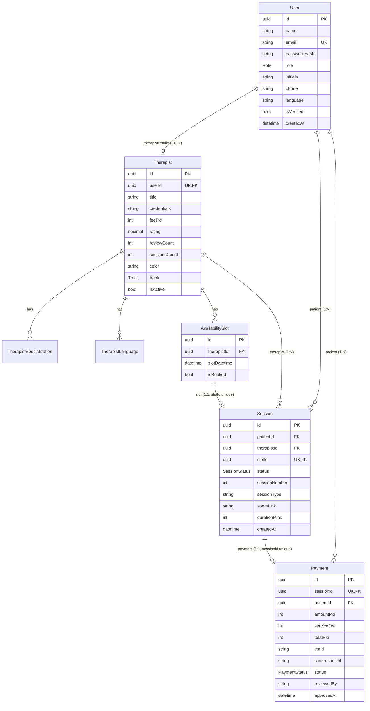

### 5.2 Tables & enums

| Table (`@@map`) | Purpose | Notable constraints |
|---|---|---|
| `users` | every account (all roles) | `email` unique |
| `therapists` | therapist profile (1:1 with a user) | `userId` unique |
| `therapist_specializations` | therapist ↔ specialization (1:N) | — |
| `therapist_languages` | therapist ↔ language (1:N) | — |
| `availability_slots` | bookable times | one optional Session |
| `sessions` | a booking | `slotId` unique (1:1 with slot) |
| `payments` | a manual payment record | `sessionId` unique (1:1 with session) |

| Enum | Values |
|---|---|
| `Role` | `PATIENT`, `THERAPIST`, `ADMIN` |
| `Track` | `MENTAL_HEALTH`, `CAREER` |
| `SessionStatus` | `PENDING_PAYMENT`, `CONFIRMED`, `IN_PROGRESS`, `COMPLETED`, `CANCELLED` |
| `PaymentStatus` | `PENDING`, `APPROVED`, `REJECTED` |

All primary keys are UUIDs (`@default(uuid())`). Money is **integer PKR**. `rating` is a
`Decimal` (cast to `Number` before it reaches the client). FKs are
`ON DELETE RESTRICT ON UPDATE CASCADE`.

### 5.3 Data-access pattern

One **singleton** `PrismaClient` ([config/db.js](../Backend/src/config/db.js)) is shared
by all services — this gives the app a single connection pool rather than opening a new
connection per query. Each service defines an `include`/`select` shape and a `format*`
helper that flattens Prisma's nested objects into clean, password-free client JSON:

```js
// therapist.service.js — include shape + formatter
const therapistInclude = {
  user: { select: { name:true, email:true, initials:true } },  // never passwordHash
  specializations: { select: { name:true } },
  languages: { select: { language:true } },
}
function formatTherapist(t) {
  return { id:t.id, name:t.user.name, feePkr:t.feePkr, rating:Number(t.rating),
           specializations:t.specializations.map(s => s.name), /* ...flattened */ }
}
```

---

## 6. Authentication Architecture

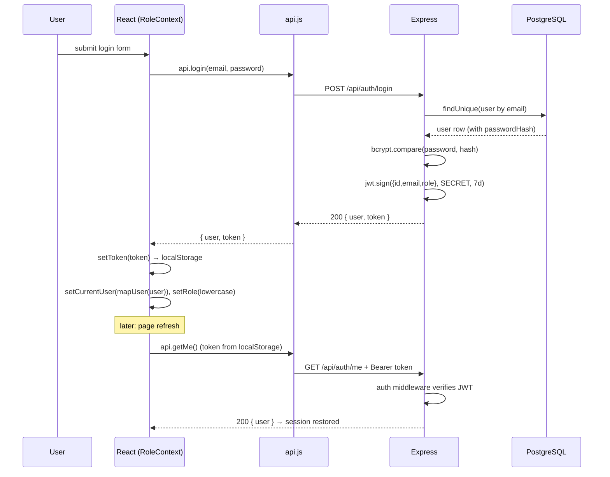

**Components:**
- **Issuing:** `signToken` in [auth.service.js](../Backend/src/services/auth.service.js)
  (HS256, payload `{id,email,role}`, 7-day expiry).
- **Storage:** `localStorage['mindbridge_token']` via helpers in
  [api.js](../Frontend/src/services/api.js).
- **Attachment:** the `request()` helper adds `Authorization: Bearer <token>` on every
  authenticated call.
- **Verification:** [middleware/auth.js](../Backend/src/middleware/auth.js) verifies the
  token and sets `req.user`.
- **Restore-on-refresh:** `RoleContext` calls `/auth/me` on mount; the `loading` flag
  prevents `ProtectedRoute` from bouncing a valid user to `/login` during that check.

**Role casing:** backend roles are UPPERCASE enums (`PATIENT`); the UI uses lowercase
(`patient`) everywhere. `RoleContext.toUiRole()` and `adapters.uiTrackToApi()` translate
across the boundary.

---

## 7. Authorization Architecture

Two enforcement layers, both server-side, plus a cosmetic client gate:

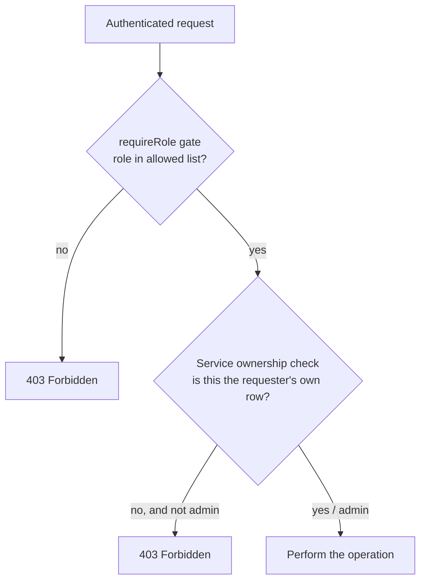

| Endpoint group | Role gate | Ownership check (service) |
|---|---|---|
| `POST /sessions`, `GET /sessions/my` | `PATIENT` | patientId = JWT id |
| `GET /sessions/:id` | any authed | `assertCanAccessSession` (patient/therapist/admin) |
| `PATCH /sessions/:id/status`, `/zoom` | `THERAPIST`,`ADMIN` | therapist.userId = JWT id (or admin) |
| `GET /sessions/therapist/my` | `THERAPIST` | resolved via relation `therapist:{userId}` |
| `POST /payments` | `PATIENT` | session.patientId = JWT id |
| `GET /payments/:id` | any authed | `assertCanAccessPayment` (owner/admin) |
| `PATCH /payments/:id/approve|reject` | `ADMIN` | — (admin only) |
| `GET /admin/*` | `ADMIN` | — (admin only) |

**Frontend mirror (UX only):** `<ProtectedRoute allowedRoles={[...]}>` in
[App.jsx](../Frontend/src/App.jsx). This is *not* security — it prevents a wrong-role
user from landing on a screen that would just 401/403 anyway.

**Defining detail:** the JWT carries the **User** id. For therapist-owned data, the
service resolves the Therapist row via the unique relation
(`where: { therapist: { userId } }`) — no extra query, no trusting the client to say
which therapist they are.

---

## 8. Scheduling Architecture

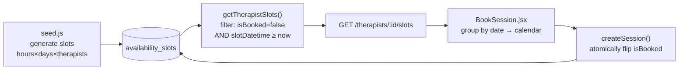

- **Generation** ([seed.js](../Backend/prisma/seed.js)): for each therapist, hours
  `[9,10,11,14,15,16]` across the next 7 days. Re-running deletes only *unbooked* slots
  and regenerates (booked slots are preserved).
- **Serving** (`getTherapistSlots` in
  [therapist.service.js](../Backend/src/services/therapist.service.js)): always filters
  to unbooked **future** slots; for a given date, clamps the lower bound to *now* so
  already-passed times today aren't offered.
- **Consuming** ([BookSession.jsx](../Frontend/src/pages/BookSession.jsx)): fetches
  slots, groups them by date key, and renders only days/times that have availability.
- **Claiming:** booking flips `isBooked = true` atomically (see §9).

---

## 9. Booking & Payment Architecture

The end-to-end value chain and where each step lives:

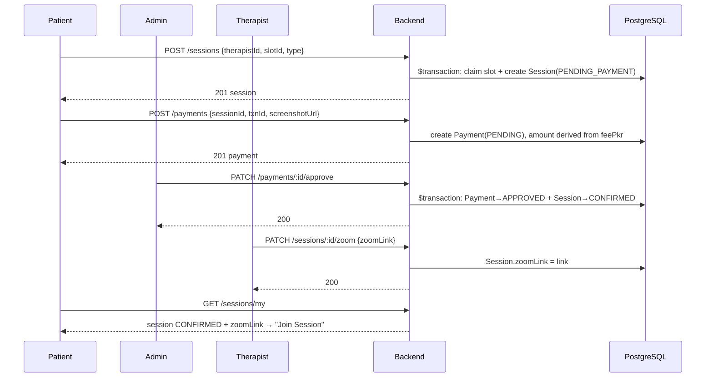

**Safety properties** (all server-enforced):
- **Atomic slot claim** prevents double-booking (`updateMany where isBooked:false`).
- **Server-derived amounts**: `totalPkr = feePkr + 250`; the client cannot set the price.
- **Server-derived identity**: `patientId` from JWT, not body.
- **Coupled approval**: payment-approve and session-confirm share one transaction.
- **Reopenable rejection**: a `REJECTED` payment can be resubmitted (back to `PENDING`).
- **Terminal guards**: `COMPLETED`/`CANCELLED` sessions can't be re-edited.

---

## 10. State Management Architecture (Frontend)

State is intentionally **local-first**, with exactly one piece of global state.

| State | Scope | Lives in |
|---|---|---|
| Auth (`role`, `currentUser`, `loading`) | **global** | `RoleContext` |
| Fetched lists (therapists, sessions, payments) | per-page | `useState` + `useEffect` in each page |
| UI toggles (active tab, dropdown open) | per-component | `useState` |
| Async button status (e.g. zoom `saving/saved/error`) | per-component | `useState` map keyed by id |
| JWT | persistent | `localStorage` (mirrored into context on load) |

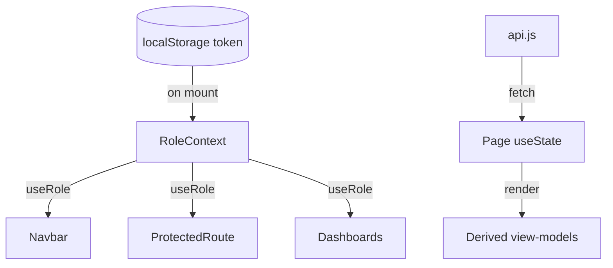

**Design principle:** the backend is the source of truth; the frontend holds only
*transient* copies. Pages fetch on mount, derive view-models (e.g. group sessions into
today/tomorrow/upcoming), and optimistically update local state after a successful
mutation (e.g. mark a payment `approved` without refetching). No Redux/MobX — Context +
hooks are sufficient at this scale.

---

## 11. File-by-File Reference

### Backend

| File | Responsibility | Key exports | Depends on |
|---|---|---|---|
| [index.js](../Backend/src/index.js) | bootstrap, middleware, mount routes, 404, error handler, listen | `app` | all routes, errorHandler, cors, dotenv |
| [config/db.js](../Backend/src/config/db.js) | singleton PrismaClient (one pool) | `prisma` | `@prisma/client` |
| [middleware/auth.js](../Backend/src/middleware/auth.js) | verify Bearer JWT → `req.user` | `auth` | jsonwebtoken |
| [middleware/requireRole.js](../Backend/src/middleware/requireRole.js) | RBAC gate factory | `requireRole` | — |
| [middleware/errorHandler.js](../Backend/src/middleware/errorHandler.js) | uniform error JSON | default | — |
| [validators/auth.validator.js](../Backend/src/validators/auth.validator.js) | register/login/updateProfile schemas | named | zod |
| [validators/session.validator.js](../Backend/src/validators/session.validator.js) | createSession/updateStatus/setZoomLink schemas | named | zod |
| [validators/payment.validator.js](../Backend/src/validators/payment.validator.js) | submitPayment schema | named | zod |
| [services/auth.service.js](../Backend/src/services/auth.service.js) | register/login/getMe/update; bcrypt, JWT, sanitize | named | db, bcrypt, jwt |
| [services/therapist.service.js](../Backend/src/services/therapist.service.js) | list/filter, byId, slots, formatTherapist | named | db |
| [services/session.service.js](../Backend/src/services/session.service.js) | create (atomic), get, status, lists, zoom | named | db |
| [services/payment.service.js](../Backend/src/services/payment.service.js) | submit (derive amount), get, approve/reject (txn) | named | db |
| [services/admin.service.js](../Backend/src/services/admin.service.js) | stats (parallel counts), users, sessions, payments | named | db |
| controllers/* | HTTP layer per resource: validate, call service, status code, `next(err)` | named | services, validators |
| routes/* | URL+verb → controller, attach `auth`/`requireRole` | router | controllers, middleware |

### Frontend

| File | Responsibility | Notes |
|---|---|---|
| [main.jsx](../Frontend/src/main.jsx) | mount React root | StrictMode |
| [App.jsx](../Frontend/src/App.jsx) | router + provider + navbar + route table | guards via ProtectedRoute |
| [context/RoleContext.jsx](../Frontend/src/context/RoleContext.jsx) | the entire client auth/session | login/register/logout/loading |
| [services/api.js](../Frontend/src/services/api.js) | the fetch client | token attach, error normalise |
| [services/adapters.js](../Frontend/src/services/adapters.js) | shape mappers | mapTherapist/mapUser/uiTrackToApi |
| [config/sidebarConfig.jsx](../Frontend/src/config/sidebarConfig.jsx) | dashboard nav per role | getNavByRole helper |
| [components/ProtectedRoute.jsx](../Frontend/src/components/ProtectedRoute.jsx) | route guard | loading-aware |
| [components/Navbar.jsx](../Frontend/src/components/Navbar.jsx) | top nav + logout | hidden on dashboards |
| [components/TherapistCard.jsx](../Frontend/src/components/TherapistCard.jsx) | therapist grid tile | uses adapted `fee`,`reviews` |
| [pages/Home.jsx](../Frontend/src/pages/Home.jsx) | landing + featured therapists | real `getTherapists` |
| [pages/Therapists.jsx](../Frontend/src/pages/Therapists.jsx) | browse + client-side filters | real `getTherapists` |
| [pages/TherapistProfile.jsx](../Frontend/src/pages/TherapistProfile.jsx) | one therapist detail | real `getTherapist` |
| [pages/BookSession.jsx](../Frontend/src/pages/BookSession.jsx) | calendar + slot pick + create session | real slots/create |
| [pages/Payment.jsx](../Frontend/src/pages/Payment.jsx) | EasyPaisa submit (by session id) | real `getSession`/`submitPayment` |
| [pages/PatientDashboard.jsx](../Frontend/src/pages/PatientDashboard.jsx) | sessions, payments, computed stats | real `getMySessions` |
| [pages/TherapistDashboard.jsx](../Frontend/src/pages/TherapistDashboard.jsx) | schedule, patients, earnings, zoom | real `getTherapistSessions` + zoom |
| [pages/AdminConsole.jsx](../Frontend/src/pages/AdminConsole.jsx) | stats, payment approve/reject | real stats/payments/users |

> **Intentional remaining mock:** `AdminConsole` still imports `adminTherapists` from
> `data/mockData.js` for the therapist-performance tables — a scoped "trim" decision in
> Phase 4B, not an oversight. Everything else runs on the real API.

---

## 12. Deployment Architecture

No deployment config ships in the repo yet (no Dockerfile/compose/CI). The intended and
natural target:

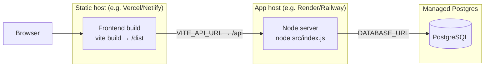

**What each side needs in production:**
- **Frontend:** `npm run build` → static files; set `VITE_API_URL` to the deployed API
  origin at build time.
- **Backend:** set `DATABASE_URL`, `JWT_SECRET` (a strong secret!), `PORT`,
  `NODE_ENV=production`; run `prisma migrate deploy` then `npm start`; optionally
  `npm run seed`.
- **Hardening before real users** (see the honest gaps in
  [concepts-explained.md §27](./concepts-explained.md#27-security-concepts-cross-cutting)):
  restrict CORS to the frontend origin, add JWT refresh/rotation, move payment
  screenshots to real object storage, and add automated tests/CI.

---

### Related docs
- [concepts-explained.md](./concepts-explained.md) — the *why* behind each idea.
- [request-flow.md](./request-flow.md) — every feature traced request-by-request.
- [phase4A-documentation.md](./phase4A-documentation.md) /
  [phase4B-documentation.md](./phase4B-documentation.md) — how this architecture was
  built.
- [master-project-guide.md](./master-project-guide.md) — the guided tour for a new hire.
