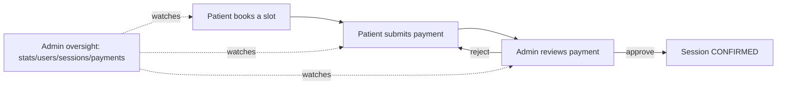
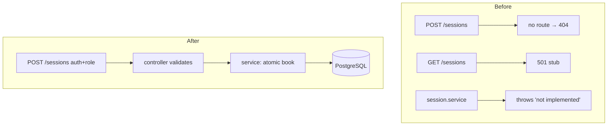
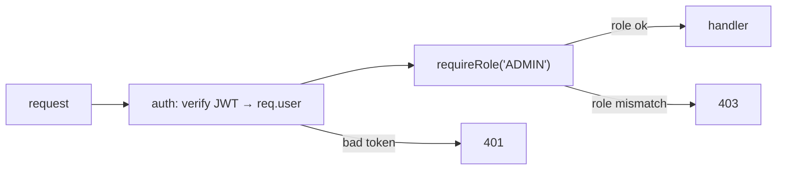
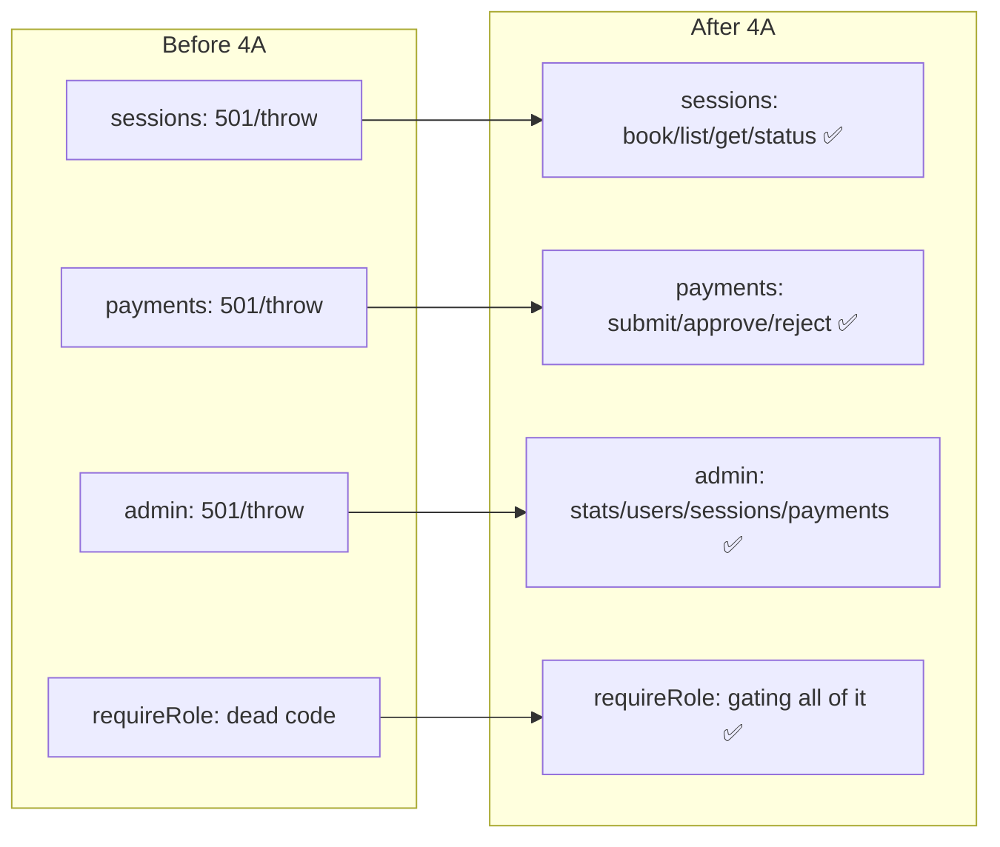

# Phase 4A Documentation — Backend Booking, Payments & Admin

> Complete documentation of **Phase 4A**: turning the stubbed session/payment/admin
> endpoints into a fully working backend. For each file: its **before** state, its
> **after** state, **why** the change was necessary, and a detailed walk-through of the
> code and the decisions behind it.

**Commits covered:**

| Commit | Title |
|---|---|
| `38fa38d` | feat: session booking endpoints (Phase 4A) |
| `7c2e5e0` | feat: payment submission + admin review (Phase 4A) |
| `862b9ab` | feat: admin oversight endpoints (Phase 4A) |

> Stack: **Express + Prisma + PostgreSQL**. Phase 4A is **backend-only** — no frontend
> files changed here. The frontend wiring is Phase 4B.

---

## Table of Contents

1. [Objectives & the Problem Being Solved](#1-objectives--the-problem-being-solved)
2. [Starting Point (the "before")](#2-starting-point-the-before)
3. [Step 1 — Session Booking Endpoints](#3-step-1--session-booking-endpoints)
4. [Step 2 — Payment Submission & Admin Review](#4-step-2--payment-submission--admin-review)
5. [Step 3 — Admin Oversight Endpoints](#5-step-3--admin-oversight-endpoints)
6. [RBAC Wiring](#6-rbac-wiring)
7. [Architectural Decisions & Trade-offs](#7-architectural-decisions--trade-offs)
8. [Challenges & Solutions](#8-challenges--solutions)
9. [Testing Performed](#9-testing-performed)
10. [Phase 4A Result Summary](#10-phase-4a-result-summary)

---

## 1. Objectives & the Problem Being Solved

**The problem.** After Phases 1–3, MindBridge had: a complete database schema, working
authentication, and a public therapist-browsing API. But the **core product loop did not
exist**. A patient could *look at* therapists but could not **book**, **pay**, or get
**confirmed**; an admin had no way to **review payments**. The session/payment/admin
layers were placeholders that returned `501 Not Implemented` (or fell through to `404`).

**The objective of Phase 4A.** Build the real backend for the booking value chain:



Concretely:
1. **Session booking** — create a session, claim a slot safely, list sessions, change
   status.
2. **Payments** — submit a manual EasyPaisa payment, approve/reject it as admin, and
   confirm the session on approval.
3. **Admin oversight** — platform stats, and listings of users/sessions/payments.
4. **RBAC** — finally *use* the `requireRole` middleware that had existed but was wired
   to nothing.

**Guiding principles (senior-engineer mode):** never trust the client (derive identity
and money server-side), make money/booking operations transactionally safe, keep the
existing layered style, and return consistent JSON envelopes and error shapes.

---

## 2. Starting Point (the "before")

Per the Phase 1–3 reconnaissance, the relevant files looked like this **before** Phase
4A:

| File | Before state |
|---|---|
| `services/session.service.js` | every function `throw new Error('not yet implemented')` |
| `services/payment.service.js` | every function `throw new Error('not yet implemented')` |
| `controllers/session.controller.js` | every method returned **HTTP 501** |
| `controllers/payment.controller.js` | every method returned **HTTP 501** |
| `controllers/admin.controller.js` | every method returned **HTTP 501** |
| `routes/session.routes.js` | only `GET /` → 501 stub (other verbs fell through to 404) |
| `routes/payment.routes.js` | only `GET /` → 501 stub |
| `routes/admin.routes.js` | only `GET /` → 501 stub |
| `middleware/requireRole.js` | fully implemented but **imported by nothing (dead code)** |
| `prisma/schema.prisma` | already complete — all booking/payment tables existed |
| `prisma/seed.js` | seeded only 4 therapists — **no slots, no patient/admin** |

**Key realisation:** the *data model was already there*. Phase 4A didn't need schema
changes — it needed to write the **service logic** and **wire the routes** that the
schema was always designed for. The seed also had to grow so the flow could be exercised
end-to-end.



---

## 3. Step 1 — Session Booking Endpoints

**Commit `38fa38d`.** Files: `services/session.service.js`,
`controllers/session.controller.js`, `routes/session.routes.js`,
`validators/session.validator.js` (new), and seed expansion.

### 3.1 The seed expansion (prerequisite)

**Before:** [seed.js](../Backend/prisma/seed.js) created 4 therapist users only —
**no AvailabilitySlots** (so `/:id/slots` was always empty) and **no PATIENT/ADMIN**
accounts to test with.

**After:** the seed now also creates:
- A **test patient** (`patient@mindbridge.pk`) and a **test admin**
  (`admin@mindbridge.pk`), all with password `password123`.
- **Availability slots** — hours `[9,10,11,14,15,16]` for the next 7 days per therapist.

**Why:** without bookable slots and non-therapist accounts, the booking flow literally
could not run. The seed is **idempotent** (`upsert` on email; only *unbooked* slots are
deleted/regenerated) so it can be re-run safely:
```js
await prisma.user.upsert({ where:{ email }, update:{}, create:{ ... } })
await prisma.availabilitySlot.deleteMany({ where:{ isBooked:false } }) // keep booked ones
```

### 3.2 The validator (new file)

**Before:** no session validator existed.
**After:** [session.validator.js](../Backend/src/validators/session.validator.js):
```js
export const createSessionSchema = z.object({
  therapistId: z.string().uuid('A valid therapist id is required'),
  slotId:      z.string().uuid('A valid slot id is required'),
  sessionType: z.string().min(1).max(50).trim(),
})
export const updateStatusSchema = z.object({
  status: z.enum(['PENDING_PAYMENT','CONFIRMED','IN_PROGRESS','COMPLETED','CANCELLED']),
})
```
**Why:** booking writes to the database and claims a shared resource — the input must be
strictly shaped (real UUIDs, a sane session type) before any of that runs. Note
`patientId` is **not** in the schema: it comes from the JWT, never the client.

### 3.3 The service (the brains)

**Before:** stubs that threw.
**After:** [session.service.js](../Backend/src/services/session.service.js) implements
`createSession`, `getSessionById`, `updateStatus`, `getSessionsByPatient`, plus two
shared helpers (`sessionInclude` shape, `formatSession` flattener) and an ownership
guard (`assertCanAccessSession`).

The centrepiece is **atomic booking**:
```js
export const createSession = async ({ patientId, therapistId, slotId, sessionType }) => {
  const therapist = await prisma.therapist.findUnique({ where: { id: therapistId } })
  if (!therapist)            { const e=new Error('Therapist not found.');                 e.status=404; throw e }
  if (!therapist.isActive)   { const e=new Error('This therapist is not accepting bookings.'); e.status=409; throw e }

  const session = await prisma.$transaction(async (tx) => {
    const slot = await tx.availabilitySlot.findUnique({ where: { id: slotId } })
    if (!slot)                          { const e=new Error('Time slot not found.');                 e.status=404; throw e }
    if (slot.therapistId !== therapistId){ const e=new Error('Slot does not belong to therapist.');  e.status=400; throw e }
    if (slot.slotDatetime < new Date()) { const e=new Error('Cannot book a slot in the past.');      e.status=400; throw e }

    // Atomic claim: only flips if STILL unbooked. Concurrent loser gets count 0.
    const claimed = await tx.availabilitySlot.updateMany({
      where: { id: slotId, isBooked: false }, data: { isBooked: true },
    })
    if (claimed.count === 0) { const e=new Error('This slot has already been booked.'); e.status=409; throw e }

    const priorCount = await tx.session.count({ where: { patientId, therapistId } })
    return tx.session.create({
      data: { patientId, therapistId, slotId, sessionType, sessionNumber: priorCount + 1, status: 'PENDING_PAYMENT' },
      include: sessionInclude,
    })
  })
  return formatSession(session)
}
```

**Why each piece:**
- **`$transaction`** — claiming the slot and creating the session must be all-or-nothing.
  If creation failed after claiming, we'd have a "booked" slot with no session. The
  transaction rolls both back together.
- **Conditional `updateMany`** — the double-booking defence (see
  [concepts §18](./concepts-explained.md#18-database-transactions--race-conditions)).
  Two simultaneous requests can't both win.
- **`sessionNumber`** — "this patient's Nth session with this therapist", computed from a
  count, so the UI can show "Session #3".
- **`formatSession`** — flattens nested Prisma data into clean client JSON and
  **intentionally drops `therapist.userId`** from the output (it's used only for authz).

`assertCanAccessSession` enforces fine-grained authz on reads:
```js
function assertCanAccessSession(session, requester) {
  if (requester.role === 'ADMIN') return
  if (session.patientId === requester.id) return
  if (session.therapist && session.therapist.userId === requester.id) return
  const e = new Error('You do not have permission to view this session.'); e.status = 403; throw e
}
```

### 3.4 The controller & routes

**Before:** controller methods returned 501; route file had only a `GET /` stub.
**After:** [session.controller.js](../Backend/src/controllers/session.controller.js)
validates input, **injects `patientId` from `req.user.id`**, calls the service, and
shapes the response; [session.routes.js](../Backend/src/routes/session.routes.js) wires
the verbs with RBAC:
```js
router.post('/',            auth, requireRole('PATIENT'),            createSession)
router.get('/my',           auth, requireRole('PATIENT'),            listPatientSessions)
router.get('/:id',          auth,                                    getSession)        // any party; ownership in service
router.patch('/:id/status', auth, requireRole('THERAPIST','ADMIN'),  updateSessionStatus)
```
**Why** `patientId` from the token: a client must never be able to book *as someone
else* — server-derived identity is the rule.

**Endpoints delivered:**

| Method | Path | Auth | Purpose |
|---|---|---|---|
| `POST` | `/api/sessions` | PATIENT | book a session (atomic) |
| `GET` | `/api/sessions/my` | PATIENT | my sessions |
| `GET` | `/api/sessions/:id` | any authed (ownership checked) | one session |
| `PATCH` | `/api/sessions/:id/status` | THERAPIST/ADMIN | change status |

---

## 4. Step 2 — Payment Submission & Admin Review

**Commit `7c2e5e0`.** Files: `services/payment.service.js`,
`controllers/payment.controller.js`, `routes/payment.routes.js`,
`validators/payment.validator.js` (new).

### 4.1 The validator (new file)

**After:** [payment.validator.js](../Backend/src/validators/payment.validator.js):
```js
export const submitPaymentSchema = z.object({
  sessionId:     z.string().uuid('A valid session id is required'),
  txnId:         z.string().min(1).max(100).trim(),
  screenshotUrl: z.string().min(1).max(500).trim(),
})
```
Notably **no amount field** — the client doesn't get to say what they owe.

### 4.2 The service

**Before:** stubs that threw.
**After:** [payment.service.js](../Backend/src/services/payment.service.js) implements
`submitPayment`, `getPaymentById`, `approvePayment`, `rejectPayment`, with a
`formatPayment` helper and `assertCanAccessPayment` guard.

**Server-derived amount + resubmission logic:**
```js
const SERVICE_FEE = 250
export const submitPayment = async ({ sessionId, patientId, txnId, screenshotUrl }) => {
  const session = await prisma.session.findUnique({
    where: { id: sessionId }, include: { therapist: { select: { feePkr: true } } },
  })
  if (!session)                               { throw 404 }
  if (session.patientId !== patientId)        { throw 403 } // pay only your own
  if (session.status !== 'PENDING_PAYMENT')   { throw 409 } // not awaiting payment

  const amountPkr = session.therapist.feePkr           // ← derived, not trusted
  const totalPkr  = amountPkr + SERVICE_FEE

  const existing = await prisma.payment.findUnique({ where: { sessionId } })
  if (existing) {
    if (existing.status === 'APPROVED') throw 409 // already paid
    if (existing.status === 'PENDING')  throw 409 // already under review
    // REJECTED → reopen for resubmission (no duplicate row)
    return formatPayment(await prisma.payment.update({ where:{sessionId}, data:{ txnId, screenshotUrl, amountPkr, totalPkr, status:'PENDING', reviewedBy:null, approvedAt:null }}))
  }
  return formatPayment(await prisma.payment.create({ data:{ sessionId, patientId, amountPkr, serviceFee:SERVICE_FEE, totalPkr, txnId, screenshotUrl, status:'PENDING' }}))
}
```

**Coupled approval (transaction):**
```js
export const approvePayment = async (id, reviewedBy) => {
  const payment = await prisma.payment.findUnique({ where: { id } })
  if (!payment)                      { throw 404 }
  if (payment.status !== 'PENDING')  { throw 409 } // can't re-approve

  return formatPayment(await prisma.$transaction(async (tx) => {
    const updated = await tx.payment.update({ where:{id}, data:{ status:'APPROVED', reviewedBy, approvedAt:new Date() }})
    await tx.session.update({ where:{ id: payment.sessionId }, data:{ status:'CONFIRMED' }}) // confirm together
    return updated
  }))
}
```
`rejectPayment` sets the payment `REJECTED` but **leaves the session
`PENDING_PAYMENT`**, so the patient can correct and resubmit.

**Why each piece:**
- **Amount from `feePkr`** — prevents a tampering client from paying PKR 1 for a PKR
  4,500 session.
- **Status guards** — model the payment lifecycle; block double-pay and double-review.
- **Reopen-on-rejected** — better UX than forcing a brand-new payment; the unique
  `sessionId` also makes a second row impossible.
- **Transaction on approve** — money state (`APPROVED`) and scheduling state
  (`CONFIRMED`) can never drift apart.
- **`reviewedBy`** — audit trail of which admin actioned it (from the admin's JWT).

### 4.3 Controller & routes

**After:** [payment.controller.js](../Backend/src/controllers/payment.controller.js)
injects `patientId`/`reviewedBy` from `req.user`;
[payment.routes.js](../Backend/src/routes/payment.routes.js):
```js
router.post('/',              auth, requireRole('PATIENT'), submitPayment)
router.get('/:id',            auth,                          getPayment)       // owner/admin in service
router.patch('/:id/approve',  auth, requireRole('ADMIN'),    approvePayment)
router.patch('/:id/reject',   auth, requireRole('ADMIN'),    rejectPayment)
```

| Method | Path | Auth | Purpose |
|---|---|---|---|
| `POST` | `/api/payments` | PATIENT | submit a payment |
| `GET` | `/api/payments/:id` | owner/admin | read a payment |
| `PATCH` | `/api/payments/:id/approve` | ADMIN | approve → confirm session |
| `PATCH` | `/api/payments/:id/reject` | ADMIN | reject → keep pending |

---

## 5. Step 3 — Admin Oversight Endpoints

**Commit `862b9ab`.** Files: `services/admin.service.js`,
`controllers/admin.controller.js`, `routes/admin.routes.js`.

**Before:** admin controller methods returned 501; route file had only a `GET /` stub;
there was no admin service.
**After:** [admin.service.js](../Backend/src/services/admin.service.js) implements
platform stats and three listings.

**Parallel stats aggregation:**
```js
export const getDashboardStats = async () => {
  const [ totalUsers, totalPatients, totalTherapists, totalAdmins,
          totalSessions, totalPayments, pendingPayments, approvedPayments,
          rejectedPayments, sessionStatusGroups, revenueAgg ] = await Promise.all([
    prisma.user.count(),
    prisma.user.count({ where:{ role:'PATIENT' } }),
    prisma.user.count({ where:{ role:'THERAPIST' } }),
    prisma.user.count({ where:{ role:'ADMIN' } }),
    prisma.session.count(),
    prisma.payment.count(),
    prisma.payment.count({ where:{ status:'PENDING' } }),
    prisma.payment.count({ where:{ status:'APPROVED' } }),
    prisma.payment.count({ where:{ status:'REJECTED' } }),
    prisma.session.groupBy({ by:['status'], _count:{ _all:true } }),
    prisma.payment.aggregate({ _sum:{ totalPkr:true }, where:{ status:'APPROVED' } }),
  ])
  // ...shape into { users, sessions:{ byStatus }, payments, revenuePkr }
}
```

**Why `Promise.all`:** these eleven independent queries have no dependency on each other;
running them in parallel makes the dashboard load roughly as slow as the *single*
slowest query, not the sum of all eleven.
**Why revenue = sum of APPROVED `totalPkr`:** only money that actually cleared review
counts as revenue — pending/rejected don't.

The three listings (`listUsers`, `listSessions`, `listPayments`) all use **`select`** to
exclude `passwordHash` and return lean oversight shapes; `listPayments` accepts an
optional `status` filter (validated against the allowed set in the controller).

**Routes:**
```js
router.get('/stats',    auth, requireRole('ADMIN'), getStats)
router.get('/users',    auth, requireRole('ADMIN'), listUsers)
router.get('/sessions', auth, requireRole('ADMIN'), listSessions)
router.get('/payments', auth, requireRole('ADMIN'), listPayments)
```

| Method | Path | Purpose |
|---|---|---|
| `GET` | `/api/admin/stats` | counts + revenue |
| `GET` | `/api/admin/users` | all users (no hashes) |
| `GET` | `/api/admin/sessions` | all sessions (oversight shape) |
| `GET` | `/api/admin/payments?status=` | all payments, optional filter |

---

## 6. RBAC Wiring

**Before:** [requireRole.js](../Backend/src/middleware/requireRole.js) was implemented
but **never imported** — pure dead code.
**After:** it gates every protected route created in Phase 4A.



This is the moment MindBridge gained **real** authorization. Combined with the in-service
ownership checks (`assertCanAccessSession`, `assertCanAccessPayment`, and the
therapist-ownership checks), the backend now enforces both *coarse* (role) and *fine*
(row ownership) access control — see
[architecture §7](./detailed-architecture.md#7-authorization-architecture).

---

## 7. Architectural Decisions & Trade-offs

| Decision | Alternative | Why we chose it | Trade-off |
|---|---|---|---|
| Atomic `updateMany(where isBooked:false)` to claim slots | read-then-write | Race-proof double-booking prevention with no locks | Slightly less obvious than a naive check |
| Wrap booking & approval in `$transaction` | separate writes | All-or-nothing consistency for money/scheduling | A little more code |
| Derive amount & identity server-side | trust the request body | Security — clients can't tamper with price or impersonate | Client must fetch session to *display* totals |
| Reopen REJECTED payment instead of new row | insert another payment | Simpler history; unique `sessionId` enforces 1:1 | Lose the rejected attempt's raw record |
| `Promise.all` for admin stats | sequential queries | Much faster dashboard | Harder to read than 11 awaits |
| `format*` + `select`/`include` shaping | return raw Prisma rows | Never leak hashes; stable client contract | Must maintain the mappers |
| Keep existing file style (no semicolons in session/payment) | reformat everything | Minimise diff/noise, respect prior authors | Two styles coexist in the repo |
| No schema changes | add tables | Schema was already complete for these features | — |

---

## 8. Challenges & Solutions

| Challenge | Solution |
|---|---|
| **Double-booking under concurrency** | Conditional `updateMany` inside a transaction; loser detects `count===0` → `409` |
| **Keeping payment & session states consistent** | Single `$transaction` for approve (Payment→APPROVED + Session→CONFIRMED) |
| **JWT carries User id, not Therapist id** | For therapist-owned reads, resolve via relation filter `therapist:{ userId }` |
| **Preventing price tampering** | Compute `amountPkr` from `therapist.feePkr`; ignore any client amount |
| **Letting patients fix a bad payment** | Reopen a REJECTED payment to PENDING rather than blocking forever |
| **No data to test with** | Expand the (idempotent) seed: test patient, admin, and real future slots |
| **Route param collision** (later, in 4B) | Declare static `/sessions/therapist/my` **before** `/sessions/:id` |
| **Leaking password hashes** | `sanitizeUser` + `select` clauses on every user-bearing response |

---

## 9. Testing Performed

Phase 4A was verified with **manual API tests** (curl/REST scripts) and, in the
follow-on work, scripted end-to-end harnesses that drive the real server:

- **Booking:** book a valid future slot → `201`; rebook the same slot → `409`; book a
  past slot → `400`; book as non-patient → `403`.
- **Payments:** submit for own pending session → `201 PENDING`; submit again → `409`;
  approve as admin → `200 APPROVED` **and** the session becomes `CONFIRMED`; approve a
  non-pending payment → `409`; reject → session stays `PENDING_PAYMENT`.
- **Admin:** `GET /admin/stats` returns numeric `users.patients` and `revenuePkr`;
  `GET /admin/payments` shows the submitted payment with patient name + total; a
  **patient** hitting `/admin/stats` → `403` (RBAC proof).
- **Slots:** default listing returns only future, unbooked slots; "today" excludes
  already-passed hours.

> There is no automated test *suite* (no Jest/Vitest) committed — testing is via manual
> and scripted checks. Adding a real suite + CI is a documented next step.

---

## 10. Phase 4A Result Summary



**Delivered:** a fully working booking/payment/admin backend with race-safe booking,
server-derived money and identity, coupled payment→session confirmation, real RBAC, and
an expanded idempotent seed. **Net:** the product's core loop now *works on the server* —
ready for the frontend to be wired to it in **Phase 4B**.

| Endpoint count added | ~12 (4 sessions, 4 payments, 4 admin) |
| New files | 2 validators (`session`, `payment`), 1 service (`admin`) |
| Rewritten files | `session.service`, `payment.service`, all three controllers + route files |
| Schema changes | none (model was already complete) |
| Frontend changes | none (that's Phase 4B) |

---

### Related docs
- [phase4B-documentation.md](./phase4B-documentation.md) — wiring the React app to these
  endpoints.
- [request-flow.md](./request-flow.md) — these endpoints traced request-by-request.
- [concepts-explained.md](./concepts-explained.md) — transactions, RBAC, idempotency,
  money handling.
