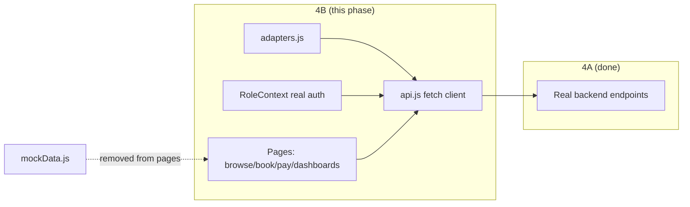
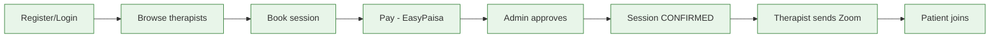

# Phase 4B Documentation — Frontend Wired to the Real API

> Complete documentation of **Phase 4B**: connecting the polished React prototype (which
> ran entirely on mock data) to the real Phase 4A backend — **without changing the UI**.
> For each area: the **before** state, the **after** state, **why** it changed, and the
> implementation detail. Plus the small backend additions (Zoom endpoint, slot fix) that
> shipped alongside the therapist dashboard.

**Commits covered:**

| Commit | Title |
|---|---|
| `242f627` | feat(frontend): real API client + auth + therapist browse |
| `d1fb383` | feat(frontend): wire booking, payment & patient dashboard |
| `89d0ec5` | feat: therapist dashboard wired + zoom-link endpoint + slot fix |
| `d5af607` | feat(frontend): wire admin console payments + stats |

> **The defining constraint (verbatim from the project owner):** *"do not change the UI
> of the frontend, do not touch that."* Phase 4B swaps **data sources only** — markup,
> styling, and layout are untouched. The single tool that made this possible is the
> **adapter layer** (see [concepts §22](./concepts-explained.md#22-the-adapter-pattern)).

---

## Table of Contents

1. [Objectives & How 4B Builds on 4A](#1-objectives--how-4b-builds-on-4a)
2. [Starting Point (the "before")](#2-starting-point-the-before)
3. [The Working Rules (senior-dev mode)](#3-the-working-rules-senior-dev-mode)
4. [Chunk 1 — API Client, Adapters & Auth](#4-chunk-1--api-client-adapters--auth)
5. [Chunk 2 — Booking, Payment & Patient Dashboard](#5-chunk-2--booking-payment--patient-dashboard)
6. [Chunk 3 — Therapist Dashboard + Zoom Endpoint + Slot Fix](#6-chunk-3--therapist-dashboard--zoom-endpoint--slot-fix)
7. [Chunk 4 — Admin Console (trimmed scope)](#7-chunk-4--admin-console-trimmed-scope)
8. [Cross-Cutting Patterns Introduced](#8-cross-cutting-patterns-introduced)
9. [Architectural Decisions & Trade-offs](#9-architectural-decisions--trade-offs)
10. [Challenges & Solutions](#10-challenges--solutions)
11. [Testing Performed](#11-testing-performed)
12. [Phase 4B Result Summary & Remaining Mock](#12-phase-4b-result-summary--remaining-mock)

---

## 1. Objectives & How 4B Builds on 4A

**Phase 4A** built a working backend. But the React app still imported `mockData.js`
directly and made **zero** HTTP calls — the two halves of the monorepo were completely
disconnected. **Phase 4B's objective:** make the real backend the app's actual data
source, end to end, so a user can register → browse → book → pay → (admin) approve →
(therapist) send Zoom → (patient) join — all on live data, persisted in PostgreSQL.



4B **consumes** every endpoint 4A produced and adds the thin client infrastructure
(fetch wrapper, adapters, token handling) that 4A deliberately left to the frontend.

---

## 2. Starting Point (the "before")

| Area | Before 4B |
|---|---|
| `services/api.js` | a **mock** returning `Promise.resolve(mockData)` — and imported by **nothing** |
| `services/adapters.js` | did not exist |
| `context/RoleContext.jsx` | fake auth: a hardcoded user "Sarah Rahman", role toggled by a visible "Demo" dropdown |
| Pages | imported `mockData.js` **directly**; no `fetch`, no JWT |
| `Login` / `Register` | cosmetic; "auth" was an email-keyword check and a context toggle |
| `Navbar` | had a demo role-switcher dropdown |
| Booking / Payment | local-only; `/payment/:id` carried a **therapist** id; submit just set `submitted=true` |
| Dashboards | rendered entirely from mock arrays; hardcoded "Dr. Arsalan Khan" |

**Implication:** the UI *looked* finished but proved nothing. 4B's job was to make it
*real* while keeping that finished look pixel-for-pixel identical.

---

## 3. The Working Rules (senior-dev mode)

These rules, set by the project owner, shaped every change in 4B:

1. **Analyze before building** — understand the existing component before touching it.
2. **Inform & get approval** — state which page/section will change and *why* before
   editing.
3. **Explain in plain English** — teaching-first, since the owner is learning.
4. **Do NOT change the UI** — only swap data sources, add minimal loading/error/empty
   states, and make necessary correctness fixes. No markup/style/layout changes.
5. **Be honest** — never fake a feature with no backing; clearly mark cosmetic sections.

The adapter pattern is what let rule #4 hold: by translating backend shapes into the
exact shapes the UI already expected, components rendered unchanged.

---

## 4. Chunk 1 — API Client, Adapters & Auth

**Commit `242f627`.** Files: `services/api.js` (rewritten), `services/adapters.js`
(new), `context/RoleContext.jsx`, `components/ProtectedRoute.jsx`,
`components/Navbar.jsx`, `pages/Login.jsx`, `pages/Register.jsx`, `pages/Home.jsx`,
`pages/Therapists.jsx`, `pages/TherapistProfile.jsx`, `.env.example` (new).

### 4.1 `api.js` — from mock to real (rewritten)

**Before:** returned hardcoded mock promises; unused.
**After:** a real [api.js](../Frontend/src/services/api.js) built on `fetch` with a
private `request()` helper (token attach, JSON, error normalisation) and a catalogue of
typed-ish methods. See the full helper in
[concepts §21](./concepts-explained.md#21-api-communication-the-fetch-client).

**Why:** centralising base URL, the `Authorization` header, and error handling in one
place means pages never touch `fetch` and behaviour can't drift across files. A network
failure becomes a distinct `status:0` error; non-2xx responses throw an `Error`
carrying `.status` and `.details`.

### 4.2 `adapters.js` — the translation layer (new)

**After:** [adapters.js](../Frontend/src/services/adapters.js) with `mapTherapist`,
`mapUser`, `uiTrackToApi`. This is the keystone of "don't change the UI":
```js
mapTherapist(t) // feePkr→fee, reviewCount→reviews, MENTAL_HEALTH→'mental-health', +feeDisplay
mapUser(u)      // backend User → { id,name,email,initials,avatar,phone,language,role }
uiTrackToApi(t) // 'mental-health' → 'MENTAL_HEALTH' for query params
```
**Why:** the UI was built against mock field names. Rather than rename fields across many
components (risky, and a UI change), the adapter converts the backend shape *into* the
expected shape at the boundary.

### 4.3 `RoleContext.jsx` — real auth (rewritten)

**Before:** hardcoded user + demo role toggle.
**After:** real `login`/`register`/`logout`, JWT persistence, and **session restore** on
mount via `/auth/me`, guarded by a `loading` flag:
```js
useEffect(() => {
  const token = getToken()
  if (!token) { setLoading(false); return }
  api.getMe()
    .then(({ user }) => { setCurrentUser(mapUser(user)); setRole(toUiRole(user.role)) })
    .catch(() => clearToken())        // bad/expired token
    .finally(() => setLoading(false))
}, [])
```
**Why:** real authentication means the token is the source of truth; restoring it on
refresh keeps users logged in, and `loading` prevents a refresh from bouncing a valid
user to `/login` (see [request-flow §C](./request-flow.md#c-session-restore-on-refresh)).

### 4.4 `ProtectedRoute`, `Navbar`, `Login`, `Register`

- **ProtectedRoute:** added the **loading state** so it waits for session restore before
  deciding to redirect.
- **Navbar:** removed the demo role-switcher; wired the dropdown's Logout to the real
  `logout()`; initials/name now come from `currentUser`.
- **Login/Register:** real submit through `RoleContext.login/register`, with submitting
  state, error banners, and role-based post-login navigation. Register maps the UI tab
  (`patient`/`therapist`) to the backend enum (UPPERCASE).

### 4.5 Browse pages: Home / Therapists / TherapistProfile

**Before:** imported `mockData.therapists`.
**After:** fetch via `api.getTherapists()` / `api.getTherapist(id)` in `useEffect`, with
loading/empty/error states. `mapTherapist` keeps `TherapistCard` rendering unchanged.
Filtering remains client-side over the fetched list.

**Endpoints consumed in Chunk 1:** `POST /auth/login`, `POST /auth/register`,
`GET /auth/me`, `GET /therapists`, `GET /therapists/:id`.

---

## 5. Chunk 2 — Booking, Payment & Patient Dashboard

**Commit `d1fb383`.** Files: `pages/BookSession.jsx`, `pages/Payment.jsx`,
`pages/PatientDashboard.jsx` (all rewritten internally).

### 5.1 `BookSession.jsx`

**Before:** read a mock therapist; calendar pinned to a hardcoded "today"
(`2026-04-12`); navigated to `/payment/:therapistId` with query params.
**After:**
- Loads the real therapist **and** real slots together: `Promise.all([api.getTherapist(id),
  api.getTherapistSlots(id)])`.
- Groups slots by date and only enables days/times that actually have availability.
- On "Proceed", calls `api.createSession(...)` and navigates to **`/payment/<session.id>`**.

```js
const data = await api.createSession({ therapistId: therapist.id, slotId: selectedSlot.id, sessionType: 'video' })
navigate(`/payment/${data.session.id}`)   // ← now a SESSION id
```
**Why the id change:** payment is now a real resource tied to a **session**. The session
must exist first (created here), so the route carries the session id, not the therapist
id. `BookSession` is the only page that links to `/payment/:id`, so the change is safe.

### 5.2 `Payment.jsx`

**Before:** read query params; submit just set local `submitted=true` (nothing sent).
**After:**
- Loads the session by id: `api.getSession(sessionId)` to render the real summary (fee,
  date/time, therapist).
- On submit, calls `api.submitPayment({ sessionId, txnId, screenshotUrl: file.name })` →
  on success shows the existing success screen.
**Why:** payment is now persisted and reviewable by an admin. The amount shown is derived
from the real session's therapist fee + the `250` service fee (server is authoritative).
**Honest limitation kept visible:** the screenshot is sent as `file.name` (a string) —
there's no file-upload server yet; documented, not faked.

### 5.3 `PatientDashboard.jsx`

**Before:** rendered `patientSessions`/`pastSessions` mock arrays; hardcoded user.
**After:** one fetch (`api.getMySessions()`) drives everything:
- Splits into `upcomingSessions` / `pastList` by date + status.
- Builds `paymentsList` from sessions that have a payment.
- Computes `totalPaid`, `pendingPaymentsCount`, `nextFee` from real data.
- Avatar colours are derived deterministically from the therapist UUID (`colorForId`),
  since the backend doesn't send a colour.
- "Join Session" appears only when `session.zoomLink` is set (closing the loop with the
  therapist dashboard).
- Logout uses the real `logout()`; "Book Session" links to `/therapists`.
**Honest cosmetic bits:** streak / mood / milestones have no backend model and stay
static (clearly inert).

**Endpoints consumed in Chunk 2:** `GET /therapists/:id`, `GET /therapists/:id/slots`,
`POST /sessions`, `GET /sessions/:id`, `POST /payments`, `GET /sessions/my`.

---

## 6. Chunk 3 — Therapist Dashboard + Zoom Endpoint + Slot Fix

**Commit `89d0ec5`.** This chunk wired the therapist dashboard *and* added the small
backend pieces it needed. The owner explicitly chose **"Option A"**: wire the Zoom link
too, not just sessions.

### 6.1 Backend additions (so the dashboard has something real to call)

**`session.service.js` — two new functions:**
```js
export const getSessionsByTherapist = async (userId) => {
  // JWT carries User.id; resolve the Therapist via the unique relation.
  const sessions = await prisma.session.findMany({
    where: { therapist: { userId } }, include: sessionInclude, orderBy: { createdAt: 'desc' },
  })
  return sessions.map(formatSession)
}
export const setZoomLink = async (id, zoomLink, requester) => {
  const session = await prisma.session.findUnique({ where: { id }, include: sessionInclude })
  if (!session) throw 404
  if (requester.role !== 'ADMIN' && session.therapist.userId !== requester.id) throw 403 // own sessions only
  return formatSession(await prisma.session.update({ where:{id}, data:{ zoomLink }, include: sessionInclude }))
}
```
**`session.validator.js` — `setZoomLinkSchema`** (must be a valid URL, ≤500 chars).
**`session.controller.js` — `listTherapistSessions`, `setSessionZoomLink`.**
**`session.routes.js` — two routes, carefully ordered:**
```js
router.get('/therapist/my', auth, requireRole('THERAPIST'), listTherapistSessions)
router.patch('/:id/zoom',   auth, requireRole('THERAPIST','ADMIN'), setSessionZoomLink)
```
> **Ordering caution:** `/sessions/therapist/my` is declared **before** `/sessions/:id`,
> otherwise Express would treat `therapist` as an `:id` and the static route would never
> match.

**`api.js` — two new methods:** `getTherapistSessions()` and
`setSessionZoomLink(id, zoomLink)`.

### 6.2 The slot fix (a real bug found during wiring)

**Before:** `getTherapistSlots` returned *all* unbooked slots, including ones in the
past (the seed runs once; days later, some slots are stale).
**After:** it filters to `slotDatetime ≥ now` (and clamps "today" to the current time):
```js
where.slotDatetime = date ? { gte: start > now ? start : now, lte: end } : { gte: now }
```
**Why:** a patient must never be offered (or able to book) an elapsed time — this was
discovered when an early end-to-end test grabbed `slots[0]`, which had already passed,
and got `400 "Cannot book a slot in the past."`

### 6.3 `TherapistDashboard.jsx` (rewritten internally)

**Before:** mock schedule; hardcoded "Dr. Arsalan Khan".
**After:** one fetch (`api.getTherapistSessions()`) feeds everything:
- **Identity** from `currentUser` (kills the hardcoded name).
- **Status mapping** `uiStatusOf()`: `IN_PROGRESS→in-progress`, `COMPLETED→done`,
  `CANCELLED→cancelled`, else `upcoming`.
- **Splits** into today / tomorrow / upcoming by parsed slot datetime.
- **Stats**: weekly count (Mon–Sun), today done/remaining, pending-payment amount.
- **My Patients**: distinct patients derived from sessions (count, last session,
  Active/On-Hold by 30-day recency).
- **Earnings**: sum of therapist fee over APPROVED payments this calendar month.
- **Zoom**: paste a link → `api.setSessionZoomLink()`; a per-session `zoomBusy` state
  drives the button label (`Send → Saving… → Sent ✓ → Retry`); the `zoomLinks` map is
  seeded from any link already on the session.
**Honest cosmetic bits:** withdrawals history, resources cards, and the License/
Availability settings have no backend model and stay static.

**Endpoints consumed/added in Chunk 3:** `GET /sessions/therapist/my` (new),
`PATCH /sessions/:id/zoom` (new).

---

## 7. Chunk 4 — Admin Console (trimmed scope)

**Commit `d5af607`.** File: `pages/AdminConsole.jsx` (internally rewritten).

The owner chose to **"Trim"** — wire the high-value parts (payments + stats + identity)
and leave the therapist-performance tables on mock for now.

**Before:** entirely mock; hardcoded "AD"/"Admin"; non-functional approve buttons.
**After:**
- Parallel load: `Promise.all([getAdminStats(), getAdminPayments(), getAdminUsers()])`,
  each with a `.catch` fallback so one failure doesn't blank the page.
- **Payment review works**: `approvePayment(id)` / `rejectPayment(id)` call the real API;
  on success the row is optimistically re-styled; `busyPayId` disables ✓/✗ during the
  call; `payError` shows inline failures.
- **Real stat cards**: Active Patients from `stats.users.patients`; New Signups from
  users with `createdAt ≥ 7 days ago`; Revenue from `stats.revenuePkr`.
- **Identity** from `currentUser` (initials/name).
- **Honest placeholders**: "Retention Rate" shows "—" / "Not tracked yet".

**Intentionally left on mock (the "trim"):** the *Therapist Performance Snapshot* and
*People → Therapists* tables still read `adminTherapists` from `mockData.js`. Wiring them
would require cross-referencing `/admin/sessions` + `/admin/users` + `/therapists`; it was
scoped out, not forgotten.

**Endpoints consumed in Chunk 4:** `GET /admin/stats`, `GET /admin/payments`,
`GET /admin/users`, `PATCH /payments/:id/approve|reject`.

---

## 8. Cross-Cutting Patterns Introduced

These appear across every wired page and are worth recognising as a toolkit:

| Pattern | What it does | Example |
|---|---|---|
| **Fetch-on-mount** | `useEffect(() => { api.x().then(setState) }, [])` | every data page |
| **`active` cleanup flag** | ignore responses after unmount | `let active = true; … return () => { active = false }` |
| **Loading / empty / error states** | graceful UI for each async phase | "Loading…", "No upcoming sessions", error banners |
| **Derived view-models** | compute UI shapes from raw data | today/tomorrow/upcoming splits; stat sums |
| **Optimistic update** | reflect a successful mutation without refetch | mark payment `approved`; mark zoom `Sent ✓` |
| **Per-action busy state** | disable buttons mid-request | `busyPayId`, `zoomBusy` |
| **Adapter at the boundary** | keep UI shape stable | `mapTherapist`, `mapUser` |
| **Resilient parallel load** | one failure ≠ blank page | `Promise.all([... .catch(fallback)])` |

---

## 9. Architectural Decisions & Trade-offs

| Decision | Alternative | Why | Trade-off |
|---|---|---|---|
| Adapter layer (`adapters.js`) | rename fields across all components | Honour "don't change the UI"; low-risk integration | One more layer to keep in sync |
| Central `fetch` client | per-page `fetch` | DRY, consistent errors/token | — |
| JWT in `localStorage` | in-memory / cookies | Survives refresh; simplest | XSS exposure (acceptable for this build) |
| `loading` guard in context/ProtectedRoute | redirect immediately | Don't bounce valid users on refresh | A brief "Loading…" flash |
| `/payment/:id` = session id | keep therapist id + query params | Payment is tied to a real session | One-line nav change in BookSession |
| Optimistic UI updates | refetch after every mutation | Snappier UX, fewer requests | Local state could drift if server later disagrees |
| Trim admin therapist tables | full cross-endpoint wiring | Ship the high-value loop first | Those tables remain mock (documented) |
| Keep cosmetic sections static | fake data to look "done" | Honesty; no misleading UI | Some panels are visibly inert |

---

## 10. Challenges & Solutions

| Challenge | Solution |
|---|---|
| **Backend shape ≠ UI shape** (feePkr vs fee, enum casing) | `adapters.js` maps at the boundary; UI untouched |
| **Stay logged in across refresh** | `RoleContext` restores via `/auth/me` with a `loading` guard |
| **Therapist→sessions mapping** (JWT has User id) | Prisma relation filter `where:{ therapist:{ userId } }` |
| **Closing the Zoom loop** | therapist `PATCH /sessions/:id/zoom` persists link → patient `/sessions/my` shows "Join" |
| **Past-slot booking failure** | backend slot fix: only serve `slotDatetime ≥ now` |
| **Route param collision** | declare `/sessions/therapist/my` before `/sessions/:id` |
| **Double-clicks on approve/zoom** | per-action busy state disables the button |
| **Don't fake unbuilt features** | mark streak/withdrawals/retention as cosmetic; show "—" placeholders |
| **Server still bound to port after stop** | kill stray `node.exe` via absolute `taskkill` path (Windows dev gotcha) |

---

## 11. Testing Performed

End-to-end harnesses drove the **real running server** for each chunk (scripts in the
session scratchpad), plus manual browser checks:

- **Therapist flow (16/16):** login → `GET /sessions/therapist/my` → set Zoom →
  re-read shows the link → patient sees "Join".
- **Admin flow (17/17):** patient books → pays → admin sees the pending payment →
  approves → **session becomes CONFIRMED** → patient (RBAC) blocked from `/admin/stats`
  (`403`).
- **Slot fix (3/3):** default listing has no past slots; "today" excludes elapsed hours.
- **Browser:** register/login both roles; browse + filter; book → pay → success screen;
  dashboards render real data; logout clears the token.

> Caveat (honest): end-to-end harnesses **book real rows**; reseed with `npm run seed`
> afterward. No automated unit-test suite is committed yet.

---

## 12. Phase 4B Result Summary & Remaining Mock



**Delivered:** the entire MindBridge loop now runs on the real API with real auth, real
RBAC, and all three dashboards live — UI unchanged throughout.

**Only intentional mock remaining:** `adminTherapists` in `AdminConsole.jsx` (the trimmed
therapist-performance tables).

**Deferred follow-ups (documented, not bugs):**
- Wire the admin therapist tables (`/admin/sessions` + `/admin/users` + `/therapists`).
- Wire Settings "Save" → `PATCH /auth/me` (currently local-only on patient/therapist).
- Real file storage for payment screenshots (currently a filename string).
- Cosmetic sections with no backend model (streak/mood/milestones; withdrawals/resources;
  retention/operation-hours).
- Security hardening: CORS allow-list, JWT refresh/rotation, server-side logout
  revocation.

| Files wired to real API | 12+ pages/components |
| New frontend files | `adapters.js`, `.env.example` |
| Backend added in 4B | 2 session functions, 1 validator, 2 controllers, 2 routes, slot fix |
| UI/markup/style changes | **none** (by design) |

---

### Related docs
- [phase4A-documentation.md](./phase4A-documentation.md) — the backend these pages call.
- [request-flow.md](./request-flow.md) — each wired flow traced end-to-end.
- [detailed-architecture.md](./detailed-architecture.md) — where adapters/context/api fit.
- [master-project-guide.md](./master-project-guide.md) — the full new-hire walkthrough.
