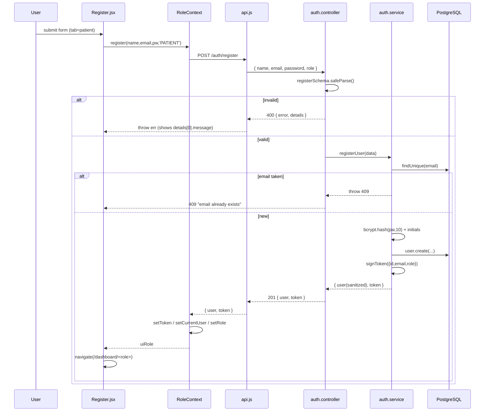
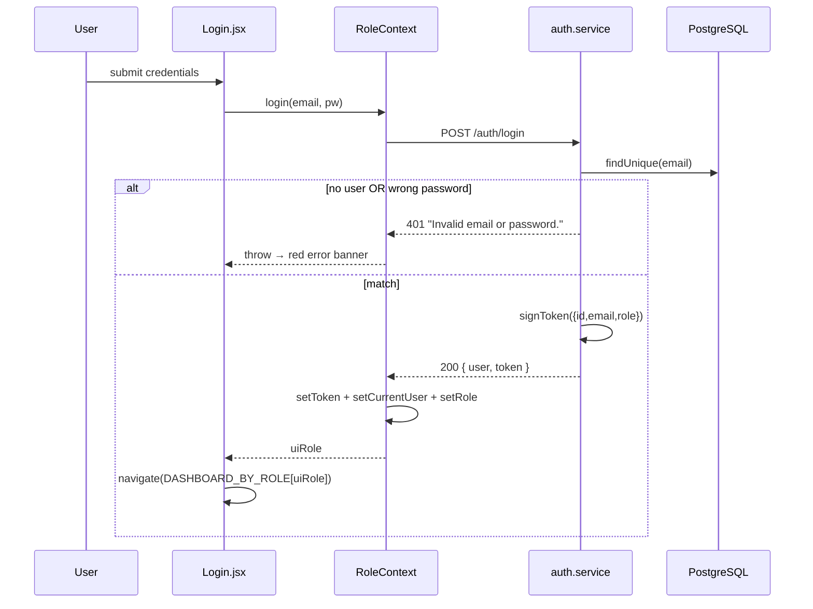
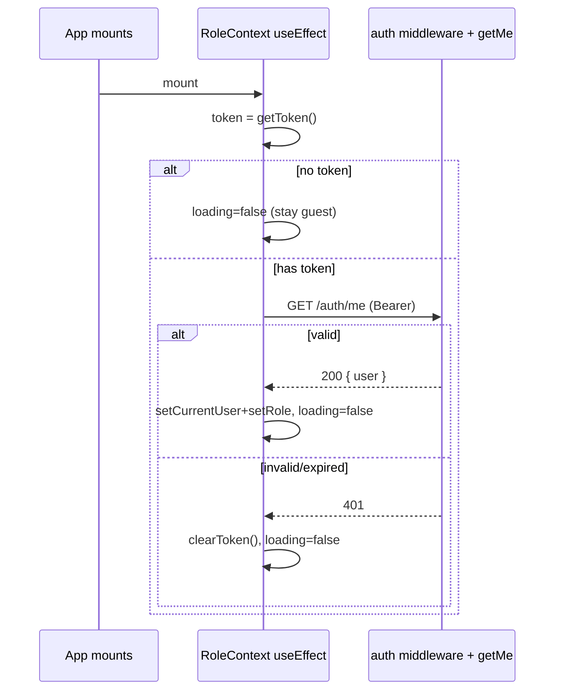
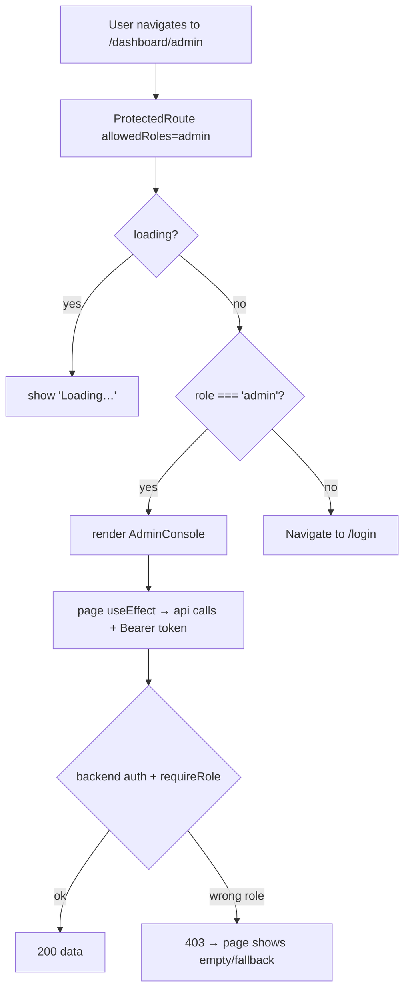
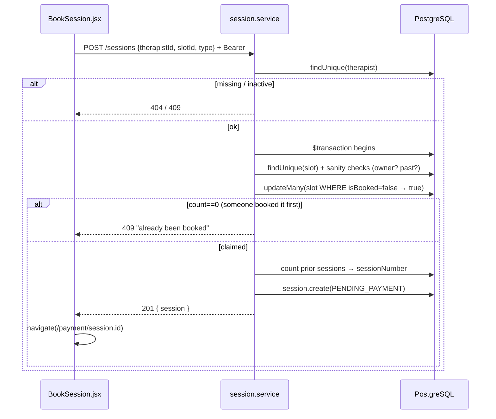
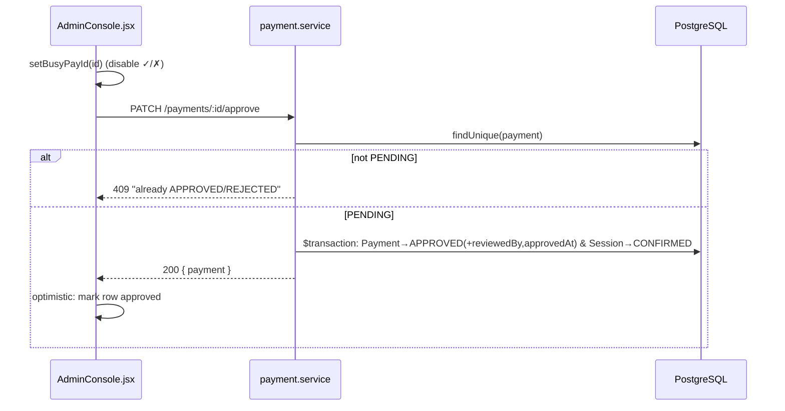

# Request Flow — MindBridge

> Every major feature traced from the **frontend trigger** all the way to the
> **database** and back to the **screen update**, with sequence diagrams, the exact
> files at each step, error paths, and edge cases.

**How to read each flow.** Every feature lists the 10-stop journey:

1. **Frontend trigger** — what the user does
2. **Component** — which React file
3. **Context** — auth/role state involved
4. **API method** — the `api.*` call
5. **Backend route** — verb + path + middleware
6. **Controller** — request handling
7. **Service** — business logic
8. **Database** — Prisma operation
9. **Response** — status + JSON
10. **Frontend update** — what changes on screen

> Stack reminder: **Express + Prisma + PostgreSQL** on the server; **React + `fetch`**
> on the client. Roles are UPPERCASE in the backend, lowercase in the UI.

---

## Table of Contents

- [A. User Registration](#a-user-registration)
- [B. User / Therapist / Admin Login](#b-user--therapist--admin-login)
- [C. Session Restore on Refresh](#c-session-restore-on-refresh)
- [D. Protected Route Access](#d-protected-route-access)
- [E. Therapist Discovery (browse + filter)](#e-therapist-discovery-browse--filter)
- [F. Therapist Profile Loading](#f-therapist-profile-loading)
- [G. Slot Generation & Loading](#g-slot-generation--loading)
- [H. Session Booking](#h-session-booking)
- [I. Payment Submission](#i-payment-submission)
- [J. Admin Payment Review (approve / reject)](#j-admin-payment-review-approve--reject)
- [K. Therapist Sets Zoom Link](#k-therapist-sets-zoom-link)
- [L. Patient Dashboard Loading](#l-patient-dashboard-loading)
- [M. Therapist Dashboard Loading](#m-therapist-dashboard-loading)
- [N. Admin Console Loading](#n-admin-console-loading)
- [O. Logout](#o-logout)
- [Error Paths & Edge Cases (summary)](#error-paths--edge-cases-summary)

---

## A. User Registration

**The 10 stops**

| # | Stop | Detail |
|---|---|---|
| 1 | Trigger | User fills name/email/password, picks "Patient" or "Therapist" tab, submits |
| 2 | Component | [Register.jsx](../Frontend/src/pages/Register.jsx) |
| 3 | Context | `register()` from [RoleContext](../Frontend/src/context/RoleContext.jsx) |
| 4 | API | `api.register(name, email, password, tab.toUpperCase())` |
| 5 | Route | `POST /api/auth/register` (no middleware — public) |
| 6 | Controller | `register` in [auth.controller.js](../Backend/src/controllers/auth.controller.js) → `registerSchema.safeParse` |
| 7 | Service | `registerUser` in [auth.service.js](../Backend/src/services/auth.service.js) |
| 8 | Database | `user.findUnique(email)` then `user.create` |
| 9 | Response | `201 { message, user, token }` |
| 10 | Update | token saved, `currentUser`/`role` set, navigate to the role's dashboard |



**Server logic (essence):**
```js
// auth.service.js
const existing = await prisma.user.findUnique({ where: { email } })
if (existing) { const e = new Error('An account with this email already exists.'); e.status = 409; throw e }
const passwordHash = await bcrypt.hash(password, 10)
const user = await prisma.user.create({ data: { name, email, passwordHash, role, initials } })
return { user: sanitizeUser(user), token: signToken({ id:user.id, email, role }) }
```

**Error paths:** Zod failure → `400` with field messages (Register shows
`details[0].message`); duplicate email → `409`; network down → `status:0` "Cannot reach
the server."
**Edge cases:** email is lowercased + trimmed by Zod, so `Bob@X.com` and `bob@x.com`
collide as intended; only `PATIENT`/`THERAPIST` may self-register (no self-made admins);
`initials` are derived from the name server-side.

---

## B. User / Therapist / Admin Login

| # | Stop | Detail |
|---|---|---|
| 1 | Trigger | Enter email + password, submit |
| 2 | Component | [Login.jsx](../Frontend/src/pages/Login.jsx) |
| 3 | Context | `login()` from RoleContext |
| 4 | API | `api.login(email, password)` |
| 5 | Route | `POST /api/auth/login` (public) |
| 6 | Controller | `login` → `loginSchema.safeParse` |
| 7 | Service | `loginUser` |
| 8 | Database | `user.findUnique(email)` + `bcrypt.compare` |
| 9 | Response | `200 { user, token }` |
| 10 | Update | save token, set context, navigate by role |



**Security note — anti-enumeration:** both "email not found" and "wrong password" return
the **same** generic `401 "Invalid email or password."`, so an attacker can't discover
which emails are registered.
**Routing by role:** `Login.jsx` maps the returned UI role to its dashboard
(`admin→/dashboard/admin`, `therapist→/dashboard/therapist`, else `/dashboard/patient`).
**Edge case:** the same flow serves all three roles — there is no separate admin login;
the role comes from the user record.

---

## C. Session Restore on Refresh

The flow that keeps you logged in across a page reload.

| # | Stop | Detail |
|---|---|---|
| 1 | Trigger | App mounts / page is refreshed |
| 2 | Component | [RoleContext](../Frontend/src/context/RoleContext.jsx) `useEffect` |
| 3 | Context | reads token via `getToken()`; `loading=true` until done |
| 4 | API | `api.getMe()` |
| 5 | Route | `GET /api/auth/me` (`auth` middleware) |
| 6 | Controller | `getMe` → `req.user.id` |
| 7 | Service | `getUserById` |
| 8 | Database | `user.findUnique(id)` |
| 9 | Response | `200 { user }` (or `401` if token bad) |
| 10 | Update | rebuild `currentUser`/`role`, or clear token; `loading=false` |



**Why `loading` matters:** `ProtectedRoute` shows a "Loading…" placeholder while
`loading` is true. Without it, a refresh on `/dashboard/patient` would render before the
token check finished, see `role==='guest'`, and **wrongly redirect to `/login`**.

---

## D. Protected Route Access

What happens when a user navigates to a guarded route.



**Two gates, two purposes:** the **frontend** `ProtectedRoute` is UX (don't show a
broken screen); the **backend** `auth + requireRole` is the real security (data is
refused server-side). Even if someone forced the admin route to render, the API calls
would return `401/403` and no data would load.
**Edge case:** a logged-in *patient* manually typing `/dashboard/admin` is redirected to
`/login` by the frontend gate; if they bypassed it, the backend returns `403`.

---

## E. Therapist Discovery (browse + filter)

| # | Stop | Detail |
|---|---|---|
| 1 | Trigger | Open Home or Therapists; adjust filters |
| 2 | Component | [Therapists.jsx](../Frontend/src/pages/Therapists.jsx) / [Home.jsx](../Frontend/src/pages/Home.jsx) |
| 3 | Context | none (public) |
| 4 | API | `api.getTherapists()` → `mapTherapist` on each |
| 5 | Route | `GET /api/therapists` (public) |
| 6 | Controller | `getTherapists` passes `req.query` through |
| 7 | Service | `getTherapists(filters)` builds a dynamic `where` |
| 8 | Database | `therapist.findMany({ where, include, orderBy:rating desc })` |
| 9 | Response | `200 { therapists: [...] }` |
| 10 | Update | grid of `TherapistCard`s; further filtering is client-side |

```mermaid
sequenceDiagram
    participant T as Therapists.jsx
    participant API as api.js
    participant SV as therapist.service
    participant DB as PostgreSQL
    T->>API: getTherapists() (on mount)
    API->>SV: GET /therapists
    SV->>SV: where = { isActive:true, ...optional filters }
    SV->>DB: findMany(include user/specs/langs, orderBy rating desc)
    DB-->>SV: therapist rows
    SV->>SV: formatTherapist() (flatten, Decimal→Number)
    SV-->>API: 200 { therapists }
    API->>API: map(mapTherapist) → fee/feeDisplay/reviews/track
    API-->>T: adapted list
    T->>T: setTherapists(); render grid; filter client-side
```

**Two-layer filtering:** the **server** can filter by `track`, `specialization`,
`language`, `minFee`/`maxFee` (Prisma `where`); the **current pages** call
`getTherapists()` with no args and then filter the returned list **client-side** (by
specialty/price/language/track). Both work; client-side keeps the UI snappy for the
small dataset.
**Adapter role:** the backend returns `feePkr`/`reviewCount`/`MENTAL_HEALTH`;
`mapTherapist` turns those into `fee`/`reviews`/`'mental-health'` so the cards render
unchanged.
**Edge case (known):** filter query params aren't validated, so `?maxFee=abc` →
`Number('abc')=NaN` flows into the query — a documented minor gap.

---

## F. Therapist Profile Loading

| # | Stop | Detail |
|---|---|---|
| 1 | Trigger | Click a card → `/therapist/:id` |
| 2 | Component | [TherapistProfile.jsx](../Frontend/src/pages/TherapistProfile.jsx) |
| 4 | API | `api.getTherapist(id)` → `mapTherapist` |
| 5 | Route | `GET /api/therapists/:id` (public) |
| 7 | Service | `getTherapistById` |
| 8 | Database | `therapist.findUnique({ where:{id}, include })` |
| 9 | Response | `200 { therapist }` or `404` |
| 10 | Update | profile renders, or a friendly "not found" with a link back |

**Error path:** missing id → service throws `404 "Therapist not found."` → the page's
`.catch` sets `therapist=null` → renders the "😔 not found" fallback with a "Browse
Therapists" link.
**Edge case:** `loading` state shows "Loading profile…"; the `feeUSD` shown is a rough
display conversion (`fee/280`) — cosmetic only.

---

## G. Slot Generation & Loading

**Generation (offline, via seed):**
```js
// seed.js — for each therapist, 6 hours × 7 days of future slots
const hours = [9,10,11,14,15,16]
for (const t of therapists) for (let day=1; day<=7; day++) for (const h of hours) {
  const slotDatetime = /* today + day at h:00 */
  await prisma.availabilitySlot.create({ data:{ therapistId:t.id, slotDatetime, isBooked:false } })
}
```

**Loading (runtime):**

| # | Stop | Detail |
|---|---|---|
| 1 | Trigger | BookSession mounts |
| 4 | API | `api.getTherapistSlots(id)` (and `getTherapist(id)`) in `Promise.all` |
| 5 | Route | `GET /api/therapists/:id/slots` (public) |
| 7 | Service | `getTherapistSlots` → `isBooked:false` AND `slotDatetime ≥ now` |
| 8 | Database | `availabilitySlot.findMany({ where, orderBy:slotDatetime asc })` |
| 9 | Response | `200 { slots: [...] }` |
| 10 | Update | slots grouped by date → calendar lights up available days/times |

**Edge case fixed in Phase 4B:** the service now refuses to return past slots (and
clamps "today" to the current time), so the patient can never select an elapsed time.
Empty result → "No available slots on this date."

---

## H. Session Booking

The first half of the booking value chain.

| # | Stop | Detail |
|---|---|---|
| 1 | Trigger | Pick date + slot, click "Proceed to Payment" |
| 2 | Component | [BookSession.jsx](../Frontend/src/pages/BookSession.jsx) |
| 3 | Context | patient JWT auto-attached |
| 4 | API | `api.createSession({ therapistId, slotId, sessionType:'video' })` |
| 5 | Route | `POST /api/sessions` (`auth`, `requireRole('PATIENT')`) |
| 6 | Controller | `createSession` → `createSessionSchema.safeParse`; **patientId from JWT** |
| 7 | Service | `createSession` — validate therapist/slot, **atomic claim**, create session |
| 8 | Database | `$transaction`: `updateMany(slot where isBooked:false)` + `session.create` |
| 9 | Response | `201 { session }` |
| 10 | Update | navigate to `/payment/<session.id>` |



**Concurrency guarantee:** the conditional `updateMany` is the linchpin — only one
racing request can flip the slot `false→true`; the loser gets a clean `409` rather than
a duplicate booking.
**Security:** `patientId` is taken from `req.user.id`, never the body, so you can't book
*as* someone else. Slot must belong to the chosen therapist and be in the future.
**Edge cases:** therapist not found → `404`; inactive therapist → `409`; past slot →
`400`; on any error the button re-enables and shows the message.

---

## I. Payment Submission

| # | Stop | Detail |
|---|---|---|
| 1 | Trigger | Enter EasyPaisa txn id + upload screenshot, submit |
| 2 | Component | [Payment.jsx](../Frontend/src/pages/Payment.jsx) (`:id` = **session** id) |
| 4 | API | `api.getSession(id)` on load; `api.submitPayment({ sessionId, txnId, screenshotUrl })` on submit |
| 5 | Route | `POST /api/payments` (`auth`, `requireRole('PATIENT')`) |
| 6 | Controller | `submitPayment` → `submitPaymentSchema.safeParse`; **patientId from JWT** |
| 7 | Service | `submitPayment` — verify ownership + state, **derive amount**, create/reopen |
| 8 | Database | `payment.findUnique(sessionId)` then `create` or reopen `update` |
| 9 | Response | `201 { payment }` (status `PENDING`) |
| 10 | Update | success screen → "Go to Dashboard" |

```mermaid
sequenceDiagram
    participant P as Payment.jsx
    participant SV as payment.service
    participant DB as PostgreSQL
    P->>SV: GET /sessions/:id (load summary: fee, slot, therapist)
    SV-->>P: session
    P->>SV: POST /payments {sessionId, txnId, screenshotUrl}
    SV->>DB: findUnique(session + therapist.feePkr)
    SV->>SV: ownership + status==PENDING_PAYMENT checks
    SV->>SV: amount=feePkr; total=amount+250
    SV->>DB: findUnique(payment by sessionId)
    alt existing APPROVED / PENDING
        SV-->>P: 409 (no duplicate)
    else existing REJECTED
        SV->>DB: update → reopen to PENDING
        SV-->>P: 201 { payment }
    else none
        SV->>DB: payment.create(PENDING)
        SV-->>P: 201 { payment }
    end
    P->>P: setSubmitted(true) → success screen
```

**Server-derived amount:** the price is computed from the therapist's `feePkr` + a fixed
`250` service fee — the client's displayed total is never trusted.
**Resubmission:** a previously rejected payment is *reopened*, not duplicated (enforced
both in logic and by the unique `Payment.sessionId`).
**Edge cases:** paying for someone else's session → `403`; paying a session not in
`PENDING_PAYMENT` → `409`; the "screenshot" is stored as a filename string (no real file
upload yet — documented).

---

## J. Admin Payment Review (approve / reject)

| # | Stop | Detail |
|---|---|---|
| 1 | Trigger | Admin clicks ✓ or ✗ on a pending payment |
| 2 | Component | [AdminConsole.jsx](../Frontend/src/pages/AdminConsole.jsx) |
| 4 | API | `api.approvePayment(id)` / `api.rejectPayment(id)` |
| 5 | Route | `PATCH /api/payments/:id/approve|reject` (`auth`, `requireRole('ADMIN')`) |
| 7 | Service | `approvePayment` (txn: payment+session) / `rejectPayment` |
| 8 | Database | approve → `$transaction` updates both; reject → updates payment only |
| 9 | Response | `200 { payment }` |
| 10 | Update | row re-styles to approved/rejected; buttons disabled during the call |



**Coupled state:** approval confirms the session in the *same* transaction, so a payment
can never be "approved" while its session stays unconfirmed.
**`reviewedBy`** is set from the admin's JWT id (server-trusted).
**Reject path:** payment → `REJECTED`, session stays `PENDING_PAYMENT` so the patient can
resubmit (closing back to flow I).
**Edge case:** double-clicking is neutralised by `busyPayId` (button disabled) on the
client and the `status !== 'PENDING'` guard on the server.

---

## K. Therapist Sets Zoom Link

The step that lights up the patient's "Join Session" button.

| # | Stop | Detail |
|---|---|---|
| 1 | Trigger | Therapist pastes a Zoom URL on a session card, clicks "Send" |
| 2 | Component | [TherapistDashboard.jsx](../Frontend/src/pages/TherapistDashboard.jsx) |
| 4 | API | `api.setSessionZoomLink(sessionId, zoomLink)` |
| 5 | Route | `PATCH /api/sessions/:id/zoom` (`auth`, `requireRole('THERAPIST','ADMIN')`) |
| 6 | Controller | `setSessionZoomLink` → `setZoomLinkSchema.safeParse` (must be a URL) |
| 7 | Service | `setZoomLink` — ownership check, update `zoomLink` |
| 8 | Database | `session.update({ data:{ zoomLink } })` |
| 9 | Response | `200 { session }` |
| 10 | Update | button shows "Saving… → Sent ✓"; patient later sees "📹 Join Session" |

```mermaid
sequenceDiagram
    participant T as TherapistDashboard
    participant SV as session.service
    participant DB as PostgreSQL
    participant P as PatientDashboard (later)
    T->>T: zoomBusy[id]='saving'
    T->>SV: PATCH /sessions/:id/zoom { zoomLink }
    SV->>DB: findUnique(session)
    SV->>SV: requester is the session's therapist? (or admin)
    SV->>DB: session.update(zoomLink)
    SV-->>T: 200 { session }
    T->>T: local state updates; button 'Sent ✓'
    P->>SV: GET /sessions/my
    SV-->>P: session.zoomLink present → "Join Session" enabled
```

**The loop closes here:** Zoom link persists in the DB; the patient dashboard reads it
back via `/sessions/my`, so a button that was "Zoom link pending" becomes a working
"Join" link.
**Ownership:** a therapist can only set links on *their own* sessions (or an admin on
any). Zod requires a valid URL.

---

## L. Patient Dashboard Loading

| # | Stop | Detail |
|---|---|---|
| 1 | Trigger | Navigate to `/dashboard/patient` |
| 2 | Component | [PatientDashboard.jsx](../Frontend/src/pages/PatientDashboard.jsx) |
| 4 | API | `api.getMySessions()` |
| 5 | Route | `GET /api/sessions/my` (`auth`, `requireRole('PATIENT')`) |
| 7 | Service | `getSessionsByPatient(req.user.id)` |
| 8 | Database | `session.findMany({ where:{patientId}, include, orderBy:createdAt desc })` |
| 9 | Response | `200 { sessions }` |
| 10 | Update | derive upcoming/past lists, payments list, and computed stats |

**Derivations (all from one fetch):** `upcomingSessions` vs `pastList` (by date +
status), `paymentsList` (sessions that have a payment), and stats `totalPaid`,
`pendingPaymentsCount`, `nextFee`. Avatar colours are derived deterministically from the
therapist UUID (`colorForId`).
**Cosmetic-only bits:** streak, mood, milestones have no backend model and are clearly
static.
**Edge case:** empty data → "No upcoming sessions. Book one →"; `loadingSessions` shows
spinners in each section.

---

## M. Therapist Dashboard Loading

| # | Stop | Detail |
|---|---|---|
| 4 | API | `api.getTherapistSessions()` (seeds the `zoomLinks` map from existing links) |
| 5 | Route | `GET /api/sessions/therapist/my` (`auth`, `requireRole('THERAPIST')`) |
| 7 | Service | `getSessionsByTherapist(userId)` via relation filter `therapist:{userId}` |
| 8 | Database | `session.findMany({ where:{ therapist:{ userId } }, include, orderBy })` |
| 10 | Update | today/tomorrow/upcoming split; stats; "My Patients"; month earnings |

**Why the relation filter:** the JWT carries the **User** id, but sessions store the
**Therapist** id. `where: { therapist: { userId } }` bridges them in one query without
trusting the client.
**Derivations:** `weeklyCount` (Mon–Sun), `todayDone`/`todayRemaining`, `pendingPayAmount`,
`totalEarningsMonth` (APPROVED payments this month), and a distinct-patient table.
**Route ordering caution:** `/sessions/therapist/my` is declared **before** `/sessions/:id`
so the static path isn't captured by the `:id` param route.

---

## N. Admin Console Loading

| # | Stop | Detail |
|---|---|---|
| 4 | API | `Promise.all([getAdminStats(), getAdminPayments(), getAdminUsers()])` |
| 5 | Routes | `GET /api/admin/stats|payments|users` (all `auth`, `requireRole('ADMIN')`) |
| 7 | Service | `getDashboardStats` (parallel counts/aggregate), `listPayments`, `listUsers` |
| 8 | Database | many `count`s + `groupBy` + `aggregate(sum totalPkr where APPROVED)` |
| 10 | Update | stat cards (patients, new-this-week, revenue), payment review table |

```mermaid
sequenceDiagram
    participant A as AdminConsole
    participant SV as admin.service
    participant DB as PostgreSQL
    A->>SV: Promise.all(stats, payments, users)
    SV->>DB: Promise.all(8 counts + groupBy + revenue aggregate)
    DB-->>SV: numbers
    SV-->>A: { stats }, { payments }, { users }
    A->>A: build statCards; map payments; newThisWeek from users.createdAt
```

**Parallelism twice:** the client fires three requests together; inside `getDashboardStats`
the server fires ~11 queries together with `Promise.all`. Both minimise latency.
**Resilience:** each admin call has a `.catch(() => fallback)` so one failing endpoint
doesn't blank the whole console.
**Intentional trim:** the therapist-performance tables still read `adminTherapists` mock;
"Retention rate" shows "—" because it isn't tracked yet (honest placeholder).

---

## O. Logout

| # | Stop | Detail |
|---|---|---|
| 1 | Trigger | Click Logout (Navbar dropdown or dashboard) |
| 2 | Component | Navbar / any dashboard |
| 3 | Context | `logout()` |
| 4 | API | (none required) — `clearToken()` + reset context |
| 10 | Update | `role='guest'`, `currentUser=null`, navigate home/login |

**Honest note:** logout is **client-side only** — it deletes the stored token and resets
context. There is a `POST /auth/logout` endpoint, but it just returns a message; the JWT
remains technically valid until it expires (no server-side revocation). A production
build would add a token blacklist or short-lived tokens + refresh.

---

## Error Paths & Edge Cases (summary)

| Situation | Where caught | Result |
|---|---|---|
| Malformed body | controller Zod `safeParse` | `400 { error:'Validation failed', details }` |
| Missing/expired JWT | `auth` middleware | `401` |
| Wrong role | `requireRole` | `403` |
| Accessing someone else's row | service ownership check | `403` |
| Unknown id | service `findUnique` guard | `404` |
| Slot already booked | atomic `updateMany` count 0 | `409` |
| Duplicate/again payment | status guard + unique key | `409` |
| Editing terminal session | status guard | `409` |
| Unhandled exception | `errorHandler` | `500` (+ stack in dev only) |
| Backend unreachable | `fetch` catch in `api.js` | `Error` with `status:0` |
| No route matched | app 404 handler | `404 { error:'Route ... not found' }` |

**Frontend resilience patterns seen throughout:**
- The `active` flag in `useEffect` ignores results that arrive after a component
  unmounts (prevents "set state on unmounted component").
- `Promise.all([...].catch(...))` so a single failure degrades gracefully.
- Per-action busy state (`busyPayId`, `zoomBusy`) disables buttons to prevent
  double-submits while a request is in flight.

---

### Related docs
- [concepts-explained.md](./concepts-explained.md) — the ideas behind each step.
- [detailed-architecture.md](./detailed-architecture.md) — the structures these flows
  travel through.
- [phase4A-documentation.md](./phase4A-documentation.md) — how the booking/payment/admin
  backend was built.
- [phase4B-documentation.md](./phase4B-documentation.md) — how the frontend was wired to
  these flows.
